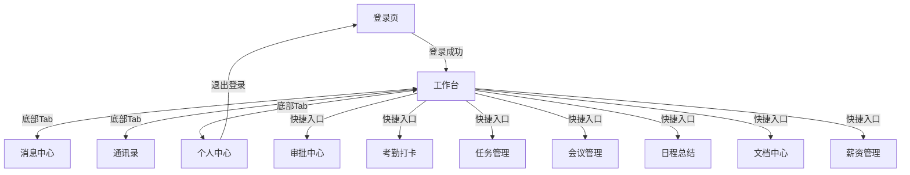

# 智能OA办公系统 - 技术架构设计

## 一、系统架构总览

### 1.1 三端架构

```
┌─────────────────────────────────────────────────────────┐
│                      用户端                              │
│  ┌─────────────────┐    ┌─────────────────┐             │
│  │  管理后台 (admin) │    │ 移动端 (expo-domes)│           │
│  │  Vue3 + Vite     │    │ RN + Expo SDK 55 │             │
│  │  手写CSS         │    │ expo-router      │             │
│  │  Port: 5174      │    │ Port: 8081       │             │
│  └────────┬────────┘    └────────┬────────┘             │
│           │  HTTP API (x-user-id) │                       │
│           └──────────┬───────────┘                       │
│                      ▼                                   │
│  ┌─────────────────────────────────────────┐             │
│  │       后端服务 (oa_server)               │             │
│  │  Node.js + Express 5 + Prisma ORM       │             │
│  │  42个路由文件, 40张表                    │             │
│  │  Port: 3000                             │             │
│  └──────────────────┬──────────────────────┘             │
│                     ▼                                    │
│  ┌─────────────────────────────────────────┐             │
│  │       MySQL 8.0 (oa_system)             │             │
│  │       40张表                            │             │
│  └─────────────────────────────────────────┘             │
└─────────────────────────────────────────────────────────┘
```

### 1.2 技术选型

| 层级 | 技术 | 版本 | 说明 |
|------|------|------|------|
| 移动端框架 | React Native (Expo) | SDK 55, RN 0.83 | 跨平台移动App |
| 移动端路由 | expo-router | - | 基于文件系统的路由 |
| 移动端动画 | react-native-reanimated | - | 高性能动画库 |
| 移动端API | fetch封装 | - | src/api/client.ts 统一封装 |
| 移动端状态 | 内存变量 | - | 无全局状态管理库，useState + 模块级变量 |
| 管理后台框架 | Vue 3 | 3.5 | Composition API + TypeScript |
| 管理后台构建 | Vite | 8.0 | 下一代前端构建工具 |
| 管理后台UI | 手写CSS | - | 无第三方UI组件库 |
| 管理后台路由 | v-if页面切换 | - | 无vue-router，App.vue中currentPage控制 |
| 管理后台状态 | Vue reactive | - | 原生响应式对象，store/index.ts集中管理 |
| 管理后台HTTP | axios | - | src/api/index.ts 统一封装 |
| 后端运行时 | Node.js | 18+ | JavaScript运行环境 |
| Web框架 | Express | 5.x | Web应用框架 |
| ORM | Prisma | 5.x | 新一代Node.js ORM |
| 数据库 | MySQL | 5.7+ (推荐8.0) | 关系型数据库 |
| 认证方式 | x-user-id请求头 | - | 前端传用户ID，后端信任该值 |
| 后端API基地址 | http://localhost:3000 | - | 开发环境 |
| 移动端API基地址 | http://8.136.126.235/api | - | 阿里云生产环境 |

---

## 二、后端服务架构 (oa_server)

### 2.1 目录结构

```
oa_server/
├── src/
│   ├── index.ts                  # 入口文件（Express配置、路由挂载、服务启动）
│   ├── routes/                   # 路由模块（42个文件）
│   │   ├── auth.ts               # 认证接口（登录/登出/权限查询）
│   │   ├── users.ts              # 用户管理（CRUD/详情/重置密码/修改密码）
│   │   ├── departments.ts        # 部门管理（CRUD/树形结构）
│   │   ├── roles.ts              # 角色管理（CRUD/权限分配）
│   │   ├── permissions.ts        # 权限管理（CRUD/树形结构）
│   │   ├── tasks.ts              # 任务管理（CRUD/完成/分配）
│   │   ├── approvals.ts          # 审批管理（CRUD/通过/拒绝/撤销/待办）
│   │   ├── meetings.ts           # 会议管理（CRUD/取消/同步腾讯会议/钉钉）
│   │   ├── documents.ts          # 文档管理（CRUD/重命名/移动/浏览下载计数）
│   │   ├── assets.ts             # 资产管理（CRUD/领用/归还/我的记录）
│   │   ├── attendance.ts         # 考勤管理（打卡/记录/统计/设备绑定）
│   │   ├── attendanceDetail.ts   # 考勤详情（详情/汇总/申诉/处罚）
│   │   ├── salary.ts             # 薪资管理（CRUD/我的薪资）
│   │   ├── projects.ts           # 项目管理（CRUD/统计）
│   │   ├── handovers.ts          # 交接管理（CRUD）
│   │   ├── notices.ts            # 公告管理（CRUD/已读/未读数/撤回）
│   │   ├── schedules.ts          # 日程管理（CRUD）
│   │   ├── processTemplates.ts   # 流程模板（CRUD）
│   │   ├── contracts.ts          # 合同管理（CRUD/我的合同/批量生成）
│   │   ├── contacts.ts           # 通讯录（查询）
│   │   ├── messages.ts           # 消息管理（列表/标记已读）
│   │   ├── positions.ts          # 岗位管理（列表）
│   │   ├── hr.ts                 # 人事信息（员工列表）
│   │   ├── system.ts             # 系统配置（获取/更新/操作日志）
│   │   ├── monitor.ts            # 系统监控（服务器/在线用户/强退）
│   │   ├── recycle.ts            # 回收站（列表/恢复/彻底删除/清空）
│   │   ├── expenses.ts           # 费用报销（CRUD/审批/核销）
│   │   ├── transfers.ts          # 异动调岗（CRUD）
│   │   ├── trainings.ts          # 培训管理（CRUD）
│   │   ├── offboardings.ts       # 离职管理（CRUD）
│   │   ├── approvalFlow.ts       # 审批流程引擎（模板/提交/操作/催办）
│   │   ├── attendanceEnhanced.ts # 考勤增强（统一打卡/请假/加班/外勤）
│   │   ├── attendanceComplete.ts # 考勤完善版
│   │   ├── attendanceDetail.ts   # 考勤详情（汇总/申诉/处罚）
│   │   ├── taskEnhanced.ts       # 任务增强（看板/评论/进度/状态拖拽）
│   │   ├── noticeEnhanced.ts     # 公告增强（已读确认/统计）
│   │   ├── noticeComplete.ts     # 公告完善版
│   │   ├── meetingBooking.ts     # 会议室预订（预订/取消/可用时段）
│   │   ├── scheduleEnhanced.ts   # 日程增强（提醒/统计）
│   │   ├── assetEnhanced.ts      # 资产增强（领用/归还/报废/维修/统计）
│   │   ├── salaryEnhanced.ts     # 薪资增强（工资条确认/异议/统计）
│   │   └── reports.ts            # 报表系统（考勤/人事/薪资/任务/资产）
│   ├── utils/
│   │   ├── authMiddleware.ts     # JWT认证中间件
│   │   ├── securityMiddleware.ts # XSS防护/输入验证/错误处理
│   │   ├── logMiddleware.ts      # 操作日志记录中间件
│   │   ├── onlineTracker.ts      # 在线用户追踪
│   │   └── swagger.ts            # OpenAPI文档生成
├── prisma/
│   └── schema.prisma             # 数据库模型定义（40张表）
├── .env                          # 环境变量
├── package.json
└── tsconfig.json
```

### 2.2 API路由总览

| 模块 | 路径前缀 | 路由文件 | 说明 |
|------|----------|----------|------|
| 认证 | /api/auth | auth.ts | 登录/登出 |
| 用户 | /api/users | users.ts | 用户CRUD |
| 部门 | /api/departments | departments.ts | 部门CRUD |
| 角色 | /api/roles | roles.ts | 角色CRUD |
| 权限 | /api/permissions | permissions.ts | 权限CRUD |
| 任务 | /api/tasks | tasks.ts | 任务CRUD |
| 审批 | /api/approvals | approvals.ts | 审批流程 |
| 会议 | /api/meetings | meetings.ts | 会议管理 |
| 文档 | /api/documents | documents.ts | 文档管理 |
| 资产 | /api/assets | assets.ts | 资产管理 |
| 考勤 | /api/attendance | attendance.ts | 考勤打卡 |
| 薪资 | /api/salary | salary.ts | 薪资管理 |
| 项目 | /api/projects | projects.ts | 项目管理 |
| 交接 | /api/handovers | handovers.ts | 工作交接 |
| 公告 | /api/notices | notices.ts | 公告通知 |
| 日程 | /api/schedules | schedules.ts | 日程管理 |
| 流程模板 | /api/processTemplates | processTemplates.ts | 流程模板管理 |
| 合同 | /api/hr/contracts | contracts.ts | 合同管理 |
| 通讯录 | /api/contacts | contacts.ts | 通讯录查询 |
| 消息 | /api/messages | messages.ts | 消息列表 |
| 岗位 | /api/positions | positions.ts | 岗位管理 |
| 人事 | /api/hr | hr.ts | 人事信息 |
| 系统 | /api/system | system.ts | 系统配置 |
| 健康检查 | /api/health | index.ts | 服务状态 |
| 监控 | /api/monitor | monitor.ts | 系统监控 |
| 回收站 | /api/recycle | recycle.ts | 数据回收站 |
| 报销 | /api/expenses | expenses.ts | 费用报销 |
| 异动调岗 | /api/transfers | transfers.ts | 异动调岗管理 |
| 培训 | /api/trainings | trainings.ts | 培训管理 |
| 离职 | /api/offboardings | offboardings.ts | 离职管理 |
| 审批流程 | /api/approval-flow | approvalFlow.ts | 审批流程引擎 |
| 考勤增强 | /api/attendance-enhanced | attendanceEnhanced.ts | 考勤增强功能 |
| 考勤完善 | /api/attendance-complete | attendanceComplete.ts | 考勤完善版 |
| 考勤详情 | /api/attendance-detail | attendanceDetail.ts | 考勤详情/申诉 |
| 任务增强 | /api/task-enhanced | taskEnhanced.ts | 任务看板/评论 |
| 公告增强 | /api/notice-enhanced | noticeEnhanced.ts | 公告增强功能 |
| 公告完善 | /api/notice-complete | noticeComplete.ts | 公告完善版 |
| 会议室预订 | /api/meeting-booking | meetingBooking.ts | 会议室预订系统 |
| 日程增强 | /api/schedule-enhanced | scheduleEnhanced.ts | 日程增强功能 |
| 资产增强 | /api/asset-enhanced | assetEnhanced.ts | 资产增强功能 |
| 薪资增强 | /api/salary-enhanced | salaryEnhanced.ts | 薪资增强功能 |
| 报表 | /api/reports | reports.ts | 报表系统 |

### 2.3 认证流程（当前实现）

> **注意：** 当前认证方式为简化版本，使用 `x-user-id` 请求头传递用户身份，无Token签发机制。

```
客户端                    服务端
  │                        │
  │  POST /api/auth/login  │
  │  {username, password}  │
  │───────────────────────>│
  │                        │  1. Bcrypt校验密码
  │                        │  2. 查询用户信息
  │  {user: {id, ...}}     │
  │<───────────────────────│
  │                        │
  │  GET /api/xxx          │
  │  x-user-id: 1          │  ← 前端存储用户ID，后续请求携带
  │───────────────────────>│
  │                        │  1. 从x-user-id获取用户身份
  │                        │  2. 执行业务逻辑
  │  {code:200, data}      │
  │<───────────────────────│
```

**待改进项：** 应升级为JWT Bearer Token认证，增加全局认证中间件，防止身份伪造。

### 2.4 权限模型

```
RBAC权限模型:
  用户(User) ──N:M──> 角色(Role) ──N:M──> 权限(Permission)
      │                    │                    │
      ├── dept_id          ├── data_scope       ├── menu (菜单)
      └── position_id      └── export_scope     ├── button (按钮)
                                                 └── api (接口)

数据权限级别:
  ├── 全部数据 (无视部门隔离)
  ├── 自定义数据 (指定部门)
  ├── 本部门数据
  ├── 本部门及以下数据
  └── 仅本人数据
```

---

## 三、管理后台前端架构 (admin)

### 3.1 技术特点

| 项目 | 说明 |
|------|------|
| UI框架 | 无第三方UI库，全部手写CSS |
| 路由方案 | 无vue-router，App.vue中通过 `currentPage` ref + `v-if` 切换页面 |
| 状态管理 | 无Pinia/Vuex，使用原生 `reactive` 对象（store/index.ts）+ 模块化 actions（20个文件） |
| HTTP请求 | axios，封装在 src/api/index.ts，约100+个接口函数 |
| 权限控制 | `hasPermission()` 按角色码判断，侧边栏菜单带锁图标 |
| 页面组织 | 29个.vue组件文件，平铺在 src/components/ 下 |

### 3.2 目录结构（实际）

```
admin/
├── src/
│   ├── App.vue                   # 根组件（含页面切换逻辑、侧边栏、顶栏）
│   ├── main.ts                   # 入口文件
│   ├── api/
│   │   └── index.ts              # API接口定义（100+个接口函数）
│   ├── components/               # 页面组件（29个.vue文件）
│   │   ├── Login.vue             # 登录页
│   │   ├── Dashboard.vue         # 仪表盘
│   │   ├── UserManagement.vue    # 用户管理
│   │   ├── HRManagement.vue      # 人事管理（合同/异动/培训/离职）
│   │   ├── AttendanceManagement.vue # 考勤管理
│   │   ├── AttendanceDetail.vue  # 考勤详情（新增）
│   │   ├── ApprovalManagement.vue # 审批管理
│   │   ├── ApprovalDetail.vue    # 审批详情（新增）
│   │   ├── WorkflowManagement.vue # 流程管理
│   │   ├── MeetingManagement.vue  # 会议管理
│   │   ├── MeetingDetail.vue     # 会议详情（新增）
│   │   ├── TaskManagement.vue     # 任务管理
│   │   ├── TaskDetail.vue        # 任务详情（新增）
│   │   ├── ScheduleManagement.vue # 日程管理
│   │   ├── DocumentManagement.vue # 文档管理
│   │   ├── ProjectManagement.vue  # 项目管理
│   │   ├── PerformanceManagement.vue # 绩效管理
│   │   ├── SalaryManagement.vue   # 薪资管理
│   │   ├── AssetManagement.vue    # 资产管理
│   │   ├── HandoverManagement.vue # 工作交接
│   │   ├── ExpenseManagement.vue  # 报销管理
│   │   ├── NoticeManagement.vue   # 公告管理
│   │   ├── SystemSettings.vue     # 系统设置
│   │   ├── ContractPreviewModal.vue # 合同预览弹窗（新增）
│   │   ├── CustomAlert.vue        # 自定义弹窗（新增）
│   │   └── PlaceholderPage.vue    # 占位页
│   ├── store/
│   │   ├── index.ts              # 全局状态（reactive对象 + loadAllData）
│   │   ├── types.ts              # TypeScript类型定义
│   │   ├── alert.ts              # 弹窗状态管理
│   │   ├── loading.ts            # 加载状态管理
│   │   └── actions/              # 模块化actions（20个文件）
│   │       ├── employee.ts       # 员工操作
│   │       ├── project.ts        # 项目操作
│   │       ├── task.ts           # 任务操作
│   │       ├── meeting.ts        # 会议操作
│   │       ├── approval.ts       # 审批操作
│   │       ├── asset.ts          # 资产操作
│   │       ├── contract.ts       # 合同操作
│   │       ├── document.ts       # 文档操作
│   │       ├── handover.ts       # 交接操作
│   │       ├── notice.ts         # 公告操作
│   │       ├── offboarding.ts    # 离职操作
│   │       ├── performance.ts    # 绩效操作
│   │       ├── processTemplate.ts # 流程模板操作
│   │       ├── salary.ts         # 薪资操作
│   │       ├── schedule.ts       # 日程操作
│   │       ├── settings.ts       # 系统设置操作
│   │       ├── training.ts       # 培训操作
│   │       ├── transfer.ts       # 异动操作
│   │       └── utils.ts          # 工具函数（formatDate/logActivity）
│   ├── utils/
│   │   ├── errorHandler.ts       # 错误处理
│   │   ├── validator.ts          # 数据验证
│   │   ├── permission.ts         # 权限工具
│   │   ├── contractPdf.ts        # 合同PDF生成
│   │   ├── contractTemplates.ts  # 合同模板
│   │   └── leaveTemplates.ts     # 请假模板
│   ├── assets/                   # 静态资源
│   └── style.css                 # 全局样式
├── package.json
└── vite.config.ts
```

### 3.3 页面导航

无vue-router，通过App.vue中的 `currentPage` 变量 + v-if 实现页面切换。共注册25+个页面路径：

| currentPage值 | 组件 | 权限 |
|---------------|------|------|
| login | Login.vue | 公开 |
| dashboard | Dashboard.vue | 已登录 |
| users | UserManagement.vue | ROLE_ADMIN |
| personnel | HRManagement.vue | ROLE_ADMIN |
| attendance | AttendanceManagement.vue | 已登录 |
| approval | ApprovalManagement.vue | 已登录 |
| process | WorkflowManagement.vue | 已登录 |
| meeting | MeetingManagement.vue | 已登录 |
| task | TaskManagement.vue | 已登录 |
| schedule | ScheduleManagement.vue | 已登录 |
| document | DocumentManagement.vue | 已登录 |
| project | ProjectManagement.vue | 已登录 |
| performance | PerformanceManagement.vue | 已登录 |
| salary | SalaryManagement.vue | 已登录 |
| asset | AssetManagement.vue | 已登录 |
| handover | HandoverManagement.vue | 已登录 |
| announce | NoticeManagement.vue | 已登录 |
| settings | SystemSettings.vue | ROLE_ADMIN |
| expense | ExpenseManagement.vue | 已登录 |
| attendance-detail | AttendanceDetail.vue | 已登录 |
| approval-detail | ApprovalDetail.vue | 已登录 |
| task-detail | TaskDetail.vue | 已登录 |
| meeting-detail | MeetingDetail.vue | 已登录 |
| /business/asset | 资产管理 | business:asset |
| /business/project | 项目管理 | business:project |
| /collaboration/handover | 工作交接 | collaboration:handover |
| /collaboration/announcement | 公告管理 | collaboration:announcement |
| /system/settings | 系统设置 | system:settings |

---

## 四、移动端架构 (expo-domes)

### 4.1 技术特点

| 项目 | 说明 |
|------|------|
| 框架 | Expo SDK 55, React Native 0.83.6, React 19.2 |
| 路由 | expo-router 文件路由（Stack导航，无Tab Navigator） |
| 状态管理 | 无全局状态管理库，useState + 模块级内存变量 |
| 会话管理 | src/api/session.ts，getCurrentUser()/setCurrentUser() 内存变量 |
| API封装 | src/api/client.ts，基于fetch的apiGet/apiPost/apiPut/apiDelete（含重试机制） |
| API基地址 | 开发环境自动检测（localhost/10.0.2.2/局域网IP） |
| 动画 | react-native-reanimated |
| 登录持久化 | 无AsyncStorage，刷新丢失登录态 |

### 4.2 目录结构（实际）

```
expo-domes/
├── src/
│   ├── api/
│   │   ├── client.ts             # fetch封装（apiGet/apiPost/apiPut/apiDelete）
│   │   ├── services.ts           # 业务接口定义（约40个接口）
│   │   └── session.ts            # 会话管理（内存变量）
│   └── app/
│       ├── _layout.tsx           # 根布局（Stack导航容器）
│       ├── index.tsx             # 登录页
│       ├── workbench.tsx         # 工作台（含手动实现的底部TabBar）
│       ├── messages.tsx          # 消息中心
│       ├── contacts.tsx          # 通讯录
│       ├── profile.tsx           # 个人中心
│       ├── approval.tsx          # 审批中心（三标签页）
│       ├── attendance.tsx        # 考勤打卡（GPS+设备绑定）
│       ├── attendance-detail.tsx # 考勤详情（新增）
│       ├── expense.tsx           # 报销管理
│       ├── salary.tsx            # 薪资管理
│       ├── tasks.tsx             # 任务管理
│       ├── meetings.tsx          # 会议管理
│       ├── schedule.tsx          # 日程总结
│       ├── documents.tsx         # 文档中心
│       ├── assets.tsx            # 资产管理
│       ├── projects.tsx          # 项目管理
│       ├── workflows.tsx         # 流程管理
│       ├── handover.tsx          # 工作交接
│       ├── notices.tsx           # 公告通知
│       ├── hr-management.tsx     # 人事管理
│       ├── performance.tsx       # 绩效管理
│       ├── notifications.tsx     # 通知设置
│       ├── security.tsx          # 安全设置
│       ├── privacy.tsx           # 隐私政策
│       ├── about.tsx             # 关于
│       ├── help.tsx              # 帮助
│       └── explore.tsx           # Expo模板残留（未使用）
├── app.json                      # Expo配置
├── package.json
└── tsconfig.json
```

### 4.2 页面导航流程



### 4.3 底部Tab导航

> **注意：** 底部TabBar在 `workbench.tsx` 内手动实现，非expo-router的Tab Navigator。

| Tab | 页面 | 说明 |
|-----|------|------|
| 工作台 | workbench.tsx | 核心门户，九宫格快捷入口、待办事项、公告 |
| 消息 | messages.tsx | 消息列表、分类筛选、未读角标 |
| 通讯录 | contacts.tsx | 员工名录、部门分组、一键拨号 |
| 我的 | profile.tsx | 个人信息、统计数据、退出登录 |

---

## 五、数据库表清单

| 模块 | 表名 | 说明 |
|------|------|------|
| 系统管理 | sys_user | 用户表 |
| | sys_department | 部门表 |
| | sys_position | 岗位表 |
| | sys_role | 角色表 |
| | sys_user_role | 用户角色关联表 |
| | sys_permission | 权限表 |
| | sys_role_permission | 角色权限关联表 |
| | sys_config | 系统配置表 |
| | sys_operation_log | 操作日志表 |
| | sys_message | 消息表 |
| 办公管理 | oa_attendance | 考勤表 |
| | oa_process_template | 流程模板表 |
| | oa_approval | 审批表 |
| | oa_approval_flow | 审批流程表 |
| | oa_project | 项目表 |
| | oa_task | 任务表 |
| | oa_meeting | 会议表 |
| | oa_schedule | 日程表 |
| 人力资源 | hr_employee_contract | 合同表 |
| | oa_salary | 薪资表 |
| 资产管理 | oa_asset | 资产表 |
| | oa_asset_record | 资产领用记录表 |
| 费用报销 | oa_expense | 报销单表 |
| | oa_expense_detail | 报销明细表 |
| 协作沟通 | oa_announcement | 公告表 |
| | oa_announcement_read | 公告已读表 |
| | oa_handover | 交接表 |
| | oa_document | 文档表 |

---

## 六、状态管理设计

### 6.1 管理后台 (Vue reactive)

```typescript
// store/index.ts - 原生reactive对象，约50KB
// 包含：用户信息、权限、当前页面、各业务模块mock数据

const store = reactive({
  // 认证
  currentUser: null as any,
  isLoggedIn: false,
  currentPage: 'login',

  // 各业务数据
  users: [],
  departments: [],
  roles: [],
  // ... 其他业务数据
})

// 权限判断
function hasPermission(code: string): boolean {
  // 按角色码判断权限
}
```

### 6.2 移动端 (内存变量)

```typescript
// src/api/session.ts - 模块级内存变量
let currentUser: any = null;

export function getCurrentUser() {
  return currentUser;
}

export function setCurrentUser(user: any) {
  currentUser = user;
}

// 各页面自行管理本地状态
// 使用 React useState + useEffect
// 无全局状态管理库（无Redux/Zustand/Pinia）
// 无持久化存储（无AsyncStorage）
```

---

## 七、开发规范

### 7.1 命名规范

| 对象 | 规范 | 示例 |
|------|------|------|
| 组件文件 | PascalCase | UserList.tsx, UserProfile.vue |
| 工具文件 | camelCase | request.ts, dateUtils.ts |
| 常量文件 | UPPER_CASE | API_BASE_URL.ts |
| 数据库表 | snake_case | sys_user, oa_approval |
| 数据库字段 | snake_case | user_id, create_time |
| API路径 | kebab-case | /api/user-role, /api/clock-in |
| 枚举值 | snake_case | pending, in_progress |

### 7.2 代码规范

- 使用函数式组件（Vue 3 Composition API / React Hooks）
- TypeScript 强类型，禁止 any
- 接口请求统一封装，携带 JWT Token
- 错误统一处理，用户友好提示

---

**文档结束** | 版本: v1.0 | 日期: 2026-05-29
