# 智能OA办公系统 - 数据库设计文档

## 概览

| 项目 | 说明 |
|------|------|
| 数据库名称 | oa_system |
| 数据库类型 | MySQL 5.7+ (推荐8.0) |
| 字符集 | utf8mb4 / utf8mb4_unicode_ci |
| 表数量 | 40张 |
| 视图数量 | 0个 |
| ORM | Prisma 5.x |

---

## 一、设计原则

1. **统一主键：** 所有表使用 `BIGINT AUTO_INCREMENT` 作为主键
2. **软删除：** 核心业务表包含 `is_deleted` 字段（0否/1是），数据不物理删除
3. **时间戳：** 所有表包含 `create_time` 和 `update_time`，自动维护
4. **命名规范：** 表名使用 `模块前缀_业务名` 格式（sys_/oa_/hr_），字段使用 snake_case
5. **外键约束：** 使用外键保证引用完整性，级联删除使用 CASCADE 或 SET NULL
6. **索引策略：** 唯一业务编码建 UK 索引，高频查询字段建普通索引

---

## 二、ER关系图

### 2.1 完整ER图

```mermaid
erDiagram
    %% 系统管理模块
    sys_department {
        bigint id PK
        varchar dept_code UK
        varchar dept_name
        bigint parent_id
        int level
        bigint leader_id
    }

    sys_position {
        bigint id PK
        varchar pos_code UK
        varchar pos_name
        int level
    }

    sys_role {
        bigint id PK
        varchar role_code UK
        varchar role_name
    }

    sys_permission {
        bigint id PK
        bigint parent_id
        varchar permission_code UK
        varchar permission_name
        varchar permission_type
    }

    sys_user {
        bigint id PK
        varchar emp_no UK
        varchar username UK
        varchar password
        varchar real_name
        bigint dept_id FK
        bigint position_id FK
    }

    sys_user_role {
        bigint id PK
        bigint user_id FK
        bigint role_id FK
    }

    sys_role_permission {
        bigint id PK
        bigint role_id FK
        bigint permission_id FK
    }

    sys_config {
        bigint id PK
        varchar config_key UK
        text config_value
    }

    sys_operation_log {
        bigint id PK
        bigint user_id
        varchar module
        varchar operation
    }

    sys_message {
        bigint id PK
        bigint receiver_id
        varchar type
        varchar title
    }

    %% 办公管理模块
    oa_attendance {
        bigint id PK
        bigint user_id FK
        date attend_date
        time clock_in_time
        time clock_out_time
        varchar status
    }

    oa_process_template {
        bigint id PK
        varchar template_code UK
        varchar type
        text nodes
    }

    oa_approval {
        bigint id PK
        varchar approval_no UK
        varchar type
        bigint applicant_id FK
        varchar status
    }

    oa_approval_flow {
        bigint id PK
        bigint approval_id FK
        bigint approver_id
        varchar status
    }

    oa_project {
        bigint id PK
        varchar project_no UK
        varchar project_name
        bigint manager_id FK
    }

    oa_task {
        bigint id PK
        varchar task_no UK
        bigint project_id FK
        bigint assignee_id FK
        varchar status
    }

    oa_meeting {
        bigint id PK
        varchar meeting_no UK
        bigint organizer_id FK
        datetime start_time
    }

    oa_schedule {
        bigint id PK
        bigint user_id FK
        datetime start_time
    }

    %% 人事管理模块
    hr_employee_contract {
        bigint id PK
        bigint user_id FK
        varchar contract_no UK
        date start_date
        date end_date
    }

    %% 业务管理模块
    oa_salary {
        bigint id PK
        bigint user_id FK
        varchar month
        decimal net_salary
    }

    oa_asset {
        bigint id PK
        varchar asset_no UK
        varchar asset_name
        varchar status
    }

    oa_asset_record {
        bigint id PK
        bigint asset_id FK
        bigint user_id FK
        varchar type
    }

    %% 沟通协作模块
    oa_announcement {
        bigint id PK
        varchar title
        bigint publisher_id FK
        varchar status
    }

    oa_announcement_read {
        bigint id PK
        bigint announcement_id FK
        bigint user_id FK
    }

    oa_handover {
        bigint id PK
        varchar handover_no UK
        bigint initiator_id FK
        bigint receiver_id FK
    }

    oa_document {
        bigint id PK
        varchar doc_name
        bigint uploader_id FK
        varchar scope
    }

    %% 关系定义
    sys_user ||--o{ sys_department : "belongs to"
    sys_user ||--o{ sys_position : "holds"
    sys_user ||--o{ sys_user_role : "has"
    sys_role ||--o{ sys_user_role : "assigned to"
    sys_role ||--o{ sys_role_permission : "has"
    sys_permission ||--o{ sys_role_permission : "granted to"
    sys_permission ||--o{ sys_permission : "parent of"

    oa_attendance }o--|| sys_user : "belongs to"
    oa_approval }o--|| sys_user : "applied by"
    oa_approval_flow }o--|| oa_approval : "part of"
    oa_project }o--|| sys_user : "managed by"
    oa_task }o--|| oa_project : "belongs to"
    oa_task }o--|| sys_user : "assigned to"
    oa_meeting }o--|| sys_user : "organized by"
    oa_schedule }o--|| sys_user : "belongs to"
    hr_employee_contract }o--|| sys_user : "signed by"
    oa_salary }o--|| sys_user : "belongs to"
    oa_asset }o--|| sys_user : "used by"
    oa_asset_record }o--|| oa_asset : "record of"
    oa_asset_record }o--|| sys_user : "borrowed by"
    oa_announcement }o--|| sys_user : "published by"
    oa_announcement_read }o--|| oa_announcement : "read by"
    oa_handover }o--|| sys_user : "initiated by"
    oa_handover }o--|| sys_user : "received by"
    oa_document }o--|| sys_user : "uploaded by"
```



---

## 三、表结构详细定义

### 3.1 系统管理模块 (10张表)

#### sys_department - 部门表

| 字段 | 类型 | 约束 | 说明 |
|------|------|------|------|
| id | BIGINT | PK, AUTO_INCREMENT | 主键ID |
| dept_code | VARCHAR(20) | UK, NOT NULL | 部门编码 |
| dept_name | VARCHAR(50) | NOT NULL | 部门名称 |
| parent_id | BIGINT | DEFAULT 0 | 上级部门ID |
| level | INT | NOT NULL, DEFAULT 1 | 层级:1顶级 2二级 |
| leader_id | BIGINT | NULL | 负责人ID |
| sort | INT | DEFAULT 0 | 排序号 |
| status | TINYINT | NOT NULL, DEFAULT 1 | 状态:0禁用 1正常 |
| remark | VARCHAR(500) | NULL | 备注 |
| create_time | DATETIME | NOT NULL, DEFAULT CURRENT_TIMESTAMP | 创建时间 |
| update_time | DATETIME | NOT NULL, ON UPDATE CURRENT_TIMESTAMP | 更新时间 |
| is_deleted | TINYINT | NOT NULL, DEFAULT 0 | 删除标记:0否 1是 |

**索引：** UK(dept_code), IDX(parent_id, level, status, is_deleted)

#### sys_position - 岗位表

| 字段 | 类型 | 约束 | 说明 |
|------|------|------|------|
| id | BIGINT | PK | 主键ID |
| pos_code | VARCHAR(20) | UK | 职位编码 |
| pos_name | VARCHAR(50) | NOT NULL | 职位名称 |
| level | INT | DEFAULT 1 | 职级:1-10 |
| sort | INT | DEFAULT 0 | 排序号 |
| status | TINYINT | DEFAULT 1 | 状态 |
| remark | VARCHAR(500) | NULL | 备注 |
| create_time | DATETIME | DEFAULT CURRENT_TIMESTAMP | 创建时间 |
| update_time | DATETIME | ON UPDATE | 更新时间 |
| is_deleted | TINYINT | DEFAULT 0 | 删除标记 |

#### sys_role - 角色表

| 字段 | 类型 | 约束 | 说明 |
|------|------|------|------|
| id | BIGINT | PK | 主键ID |
| role_code | VARCHAR(20) | UK | 角色编码 |
| role_name | VARCHAR(50) | NOT NULL | 角色名称 |
| description | VARCHAR(200) | NULL | 角色描述 |
| status | TINYINT | DEFAULT 1 | 状态 |
| sort | INT | DEFAULT 0 | 排序号 |
| create_time | DATETIME | DEFAULT CURRENT_TIMESTAMP | 创建时间 |
| update_time | DATETIME | ON UPDATE | 更新时间 |
| is_deleted | TINYINT | DEFAULT 0 | 删除标记 |

#### sys_permission - 权限表

| 字段 | 类型 | 约束 | 说明 |
|------|------|------|------|
| id | BIGINT | PK | 主键ID |
| parent_id | BIGINT | DEFAULT 0 | 父权限ID |
| permission_code | VARCHAR(50) | UK | 权限编码 |
| permission_name | VARCHAR(50) | NOT NULL | 权限名称 |
| permission_type | VARCHAR(20) | NOT NULL | 类型:menu/button/api |
| route_path | VARCHAR(200) | NULL | 路由路径 |
| component_path | VARCHAR(200) | NULL | 组件路径 |
| icon | VARCHAR(50) | NULL | 图标 |
| sort | INT | DEFAULT 0 | 排序号 |
| status | TINYINT | DEFAULT 1 | 状态 |
| create_time | DATETIME | DEFAULT CURRENT_TIMESTAMP | 创建时间 |
| update_time | DATETIME | ON UPDATE | 更新时间 |
| is_deleted | TINYINT | DEFAULT 0 | 删除标记 |

#### sys_user - 用户表

| 字段 | 类型 | 约束 | 说明 |
|------|------|------|------|
| id | BIGINT | PK | 主键ID |
| emp_no | VARCHAR(20) | UK | 工号 |
| username | VARCHAR(50) | UK | 登录账号 |
| password | VARCHAR(255) | NOT NULL | 加密密码(Bcrypt) |
| real_name | VARCHAR(50) | NOT NULL | 真实姓名 |
| nickname | VARCHAR(50) | NULL | 昵称 |
| gender | TINYINT | DEFAULT 1 | 性别:0女 1男 |
| mobile | VARCHAR(11) | NOT NULL | 手机号 |
| email | VARCHAR(100) | NULL | 邮箱 |
| avatar | VARCHAR(255) | NULL | 头像URL |
| dept_id | BIGINT | FK -> sys_department | 部门ID |
| position_id | BIGINT | FK -> sys_position | 职位ID |
| status | TINYINT | DEFAULT 1 | 状态:0禁用 1正常 |
| entry_date | DATE | NULL | 入职日期 |
| contract_expire | DATE | NULL | 合同到期日期 |
| probation_end | DATE | NULL | 试用期结束日期 |
| last_login_time | DATETIME | NULL | 最后登录时间 |
| last_login_ip | VARCHAR(50) | NULL | 最后登录IP |
| login_fail_count | INT | DEFAULT 0 | 登录失败次数 |
| lock_time | DATETIME | NULL | 锁定时间 |
| create_time | DATETIME | DEFAULT CURRENT_TIMESTAMP | 创建时间 |
| update_time | DATETIME | ON UPDATE | 更新时间 |
| is_deleted | TINYINT | DEFAULT 0 | 删除标记 |

**索引：** UK(emp_no, username), IDX(real_name, mobile, dept_id, position_id, status, is_deleted)
**外键：** dept_id -> sys_department(id) ON DELETE SET NULL, position_id -> sys_position(id) ON DELETE SET NULL

#### sys_user_role - 用户角色关联表

| 字段 | 类型 | 约束 | 说明 |
|------|------|------|------|
| id | BIGINT | PK | 主键ID |
| user_id | BIGINT | FK, NOT NULL | 用户ID |
| role_id | BIGINT | FK, NOT NULL | 角色ID |
| create_time | DATETIME | DEFAULT CURRENT_TIMESTAMP | 创建时间 |

**唯一约束：** UK(user_id, role_id)
**外键：** user_id -> sys_user(id) CASCADE, role_id -> sys_role(id) CASCADE

#### sys_role_permission - 角色权限关联表

| 字段 | 类型 | 约束 | 说明 |
|------|------|------|------|
| id | BIGINT | PK | 主键ID |
| role_id | BIGINT | FK, NOT NULL | 角色ID |
| permission_id | BIGINT | FK, NOT NULL | 权限ID |
| create_time | DATETIME | DEFAULT CURRENT_TIMESTAMP | 创建时间 |

**唯一约束：** UK(role_id, permission_id)
**外键：** role_id -> sys_role(id) CASCADE, permission_id -> sys_permission(id) CASCADE

#### sys_config - 系统配置表

| 字段 | 类型 | 约束 | 说明 |
|------|------|------|------|
| id | BIGINT | PK | 主键ID |
| config_key | VARCHAR(50) | UK | 配置键 |
| config_value | TEXT | NULL | 配置值 |
| config_type | VARCHAR(20) | DEFAULT 'string' | 类型:string/number/boolean/json |
| description | VARCHAR(200) | NULL | 描述 |
| group_name | VARCHAR(50) | NULL | 分组名称 |
| create_time | DATETIME | DEFAULT CURRENT_TIMESTAMP | 创建时间 |
| update_time | DATETIME | ON UPDATE | 更新时间 |

#### sys_operation_log - 操作日志表

| 字段 | 类型 | 约束 | 说明 |
|------|------|------|------|
| id | BIGINT | PK | 主键ID |
| user_id | BIGINT | NOT NULL | 用户ID |
| username | VARCHAR(50) | NULL | 用户名 |
| real_name | VARCHAR(50) | NULL | 真实姓名 |
| module | VARCHAR(50) | NULL | 模块名称 |
| operation | VARCHAR(50) | NOT NULL | 操作类型 |
| method | VARCHAR(100) | NULL | 请求方法 |
| request_url | VARCHAR(200) | NULL | 请求URL |
| request_params | TEXT | NULL | 请求参数 |
| request_ip | VARCHAR(50) | NULL | 请求IP |
| ip_location | VARCHAR(100) | NULL | IP归属地 |
| status | TINYINT | DEFAULT 1 | 状态:0失败 1成功 |
| error_msg | VARCHAR(500) | NULL | 错误信息 |
| execute_time | INT | DEFAULT 0 | 执行时长(毫秒) |
| create_time | DATETIME | DEFAULT CURRENT_TIMESTAMP | 创建时间 |

#### sys_message - 消息表

| 字段 | 类型 | 约束 | 说明 |
|------|------|------|------|
| id | BIGINT | PK | 主键ID |
| sender_id | BIGINT | NULL | 发送人ID(系统消息为空) |
| receiver_id | BIGINT | NOT NULL | 接收人ID |
| type | VARCHAR(20) | NOT NULL | 类型:approval/notice/system |
| title | VARCHAR(100) | NOT NULL | 消息标题 |
| content | VARCHAR(500) | NOT NULL | 消息内容 |
| related_id | BIGINT | NULL | 关联ID |
| related_type | VARCHAR(20) | NULL | 关联类型 |
| is_read | TINYINT | DEFAULT 0 | 是否已读:0否 1是 |
| read_time | DATETIME | NULL | 阅读时间 |
| create_time | DATETIME | DEFAULT CURRENT_TIMESTAMP | 创建时间 |

### 3.2 办公管理模块 (14张表)

#### oa_attendance - 考勤记录表

| 字段 | 类型 | 约束 | 说明 |
|------|------|------|------|
| id | BIGINT | PK | 主键ID |
| user_id | BIGINT | NOT NULL | 用户ID |
| attend_date | DATE | NOT NULL | 考勤日期 |
| clock_in_time | TIME | NULL | 上班打卡时间 |
| clock_out_time | TIME | NULL | 下班打卡时间 |
| work_hours | DECIMAL(4,2) | DEFAULT 0 | 工作时长(小时) |
| clock_in_location | VARCHAR(100) | NULL | 上班打卡位置 |
| clock_out_location | VARCHAR(100) | NULL | 下班打卡位置 |
| clock_in_latitude | DECIMAL(10,6) | NULL | 上班打卡纬度 |
| clock_in_longitude | DECIMAL(10,6) | NULL | 上班打卡经度 |
| clock_out_latitude | DECIMAL(10,6) | NULL | 下班打卡纬度 |
| clock_out_longitude | DECIMAL(10,6) | NULL | 下班打卡经度 |
| clock_in_device | VARCHAR(50) | NULL | 上班打卡设备 |
| clock_out_device | VARCHAR(50) | NULL | 下班打卡设备 |
| status | VARCHAR(20) | DEFAULT 'absent' | 状态:normal/late/early/late_early/absent/leave |
| remark | VARCHAR(500) | NULL | 备注 |
| create_time | DATETIME | DEFAULT CURRENT_TIMESTAMP | 创建时间 |
| update_time | DATETIME | ON UPDATE | 更新时间 |

**唯一约束：** UK(user_id, attend_date)

#### oa_process_template - 流程模板表

| 字段 | 类型 | 说明 |
|------|------|------|
| id | BIGINT | 主键 |
| template_code | VARCHAR(20) UK | 流程编码 |
| template_name | VARCHAR(50) | 流程名称 |
| type | VARCHAR(20) | 类型:leave/expense/travel/overtime/purchase/seal |
| scope | VARCHAR(20) | 适用范围:all/dept |
| dept_ids | VARCHAR(500) | 部门ID列表(逗号分隔) |
| nodes | TEXT | 节点配置JSON |
| form_fields | TEXT | 表单字段JSON |
| status | TINYINT | 状态:0停用 1启用 |
| sort | INT | 排序号 |

#### oa_approval - 审批记录表

| 字段 | 类型 | 说明 |
|------|------|------|
| id | BIGINT | 主键 |
| approval_no | VARCHAR(30) UK | 审批编号 |
| type | VARCHAR(20) | 类型 |
| title | VARCHAR(100) | 审批标题 |
| applicant_id | BIGINT | 申请人ID |
| dept_id | BIGINT | 申请部门ID |
| content | TEXT | 审批内容JSON |
| template_id | BIGINT | 流程模板ID |
| current_node | VARCHAR(50) | 当前审批节点 |
| current_approver_id | BIGINT | 当前审批人ID |
| status | VARCHAR(20) | 状态:pending/approved/rejected/cancelled |
| reject_reason | VARCHAR(500) | 拒绝原因 |
| cancel_reason | VARCHAR(500) | 撤回原因 |
| approved_time | DATETIME | 通过时间 |

#### oa_approval_flow - 审批流程表

| 字段 | 类型 | 说明 |
|------|------|------|
| id | BIGINT | 主键 |
| approval_id | BIGINT FK | 审批记录ID |
| node_name | VARCHAR(50) | 节点名称 |
| node_order | INT | 节点顺序 |
| approver_id | BIGINT | 审批人ID |
| approver_name | VARCHAR(50) | 审批人姓名 |
| approver_type | VARCHAR(20) | 审批人类型:user/role |
| role_id | BIGINT | 角色ID |
| status | VARCHAR(20) | 状态:pending/approved/rejected/skipped |
| opinion | VARCHAR(500) | 审批意见 |
| handle_time | DATETIME | 处理时间 |

#### oa_project - 项目表

| 字段 | 类型 | 说明 |
|------|------|------|
| id | BIGINT | 主键 |
| project_no | VARCHAR(30) UK | 项目编号 |
| project_name | VARCHAR(100) | 项目名称 |
| description | TEXT | 项目描述 |
| manager_id | BIGINT | 项目经理ID |
| start_date | DATE | 开始日期 |
| end_date | DATE | 结束日期 |
| progress | INT | 进度:0-100 |
| status | VARCHAR(20) | 状态:pending/in_progress/completed/paused |
| priority | VARCHAR(20) | 优先级:high/medium/low |

#### oa_task - 任务表

| 字段 | 类型 | 说明 |
|------|------|------|
| id | BIGINT | 主键 |
| task_no | VARCHAR(30) UK | 任务编号 |
| title | VARCHAR(100) | 任务标题 |
| description | TEXT | 任务描述 |
| project_id | BIGINT FK | 所属项目ID |
| assignee_id | BIGINT | 负责人ID |
| creator_id | BIGINT | 创建人ID |
| priority | VARCHAR(20) | 优先级:high/medium/low |
| due_date | DATE | 截止日期 |
| progress | INT | 进度:0-100 |
| status | VARCHAR(20) | 状态:pending/in_progress/completed/overdue |
| completed_time | DATETIME | 完成时间 |

#### oa_meeting - 会议表

| 字段 | 类型 | 说明 |
|------|------|------|
| id | BIGINT | 主键 |
| meeting_no | VARCHAR(30) UK | 会议编号 |
| title | VARCHAR(100) | 会议主题 |
| organizer_id | BIGINT | 组织者ID |
| room_id | BIGINT | 会议室ID |
| room_name | VARCHAR(50) | 会议室名称 |
| start_time | DATETIME | 开始时间 |
| end_time | DATETIME | 结束时间 |
| attendees | TEXT | 参会人ID列表JSON |
| status | VARCHAR(20) | 状态:upcoming/ongoing/completed/cancelled |
| minutes | TEXT | 会议纪要 |
| cancel_reason | VARCHAR(500) | 取消原因 |

#### oa_schedule - 日程表

| 字段 | 类型 | 说明 |
|------|------|------|
| id | BIGINT | 主键 |
| title | VARCHAR(100) | 日程标题 |
| description | VARCHAR(500) | 日程描述 |
| user_id | BIGINT | 用户ID |
| start_time | DATETIME | 开始时间 |
| end_time | DATETIME | 结束时间 |
| location | VARCHAR(100) | 地点 |
| type | VARCHAR(20) | 类型:personal/team/meeting |
| attendees | TEXT | 参会人ID列表JSON |
| remind_minutes | INT | 提醒时间(分钟) |
| reminded | TINYINT | 是否已提醒 |

#### oa_attendance_rule - 考勤规则表

| 字段 | 类型 | 说明 |
|------|------|------|
| id | BIGINT | 主键 |
| name | VARCHAR(100) | 规则名称 |
| work_start | TIME | 上班时间(默认09:00) |
| work_end | TIME | 下班时间(默认18:00) |
| flexible_minutes | INT | 弹性分钟数(默认30) |
| late_threshold | INT | 迟到阈值(分钟) |
| early_leave_threshold | INT | 早退阈值(分钟) |
| status | TINYINT | 状态(1启用/0停用) |

#### oa_task_comment - 任务评论表

| 字段 | 类型 | 说明 |
|------|------|------|
| id | BIGINT | 主键 |
| task_id | BIGINT FK | 任务ID |
| user_id | BIGINT FK | 评论人ID |
| content | TEXT | 评论内容 |
| attachments | JSON | 附件JSON |

#### oa_project_member - 项目成员表

| 字段 | 类型 | 说明 |
|------|------|------|
| id | BIGINT | 主键 |
| project_id | BIGINT FK | 项目ID |
| user_id | BIGINT FK | 用户ID |
| role | VARCHAR(50) | 角色(默认member) |
| join_time | DATETIME | 加入时间 |
| UK | (project_id, user_id) | 唯一约束 |

#### oa_meeting_room - 会议室表

| 字段 | 类型 | 说明 |
|------|------|------|
| id | BIGINT | 主键 |
| name | VARCHAR(100) | 会议室名称 |
| location | VARCHAR(200) | 位置 |
| capacity | INT | 容量(默认10) |
| equipment | JSON | 设备信息 |
| status | TINYINT | 状态(1可用/0不可用) |

#### oa_meeting_booking - 会议室预订表

| 字段 | 类型 | 说明 |
|------|------|------|
| id | BIGINT | 主键 |
| room_id | BIGINT FK | 会议室ID |
| meeting_id | BIGINT FK | 关联会议ID |
| booker_id | BIGINT FK | 预订人ID |
| start_time | DATETIME | 开始时间 |
| end_time | DATETIME | 结束时间 |
| status | VARCHAR(20) | 状态(booked/cancelled) |

#### oa_schedule_reminder - 日程提醒表

| 字段 | 类型 | 说明 |
|------|------|------|
| id | BIGINT | 主键 |
| schedule_id | BIGINT FK | 日程ID |
| user_id | BIGINT FK | 用户ID |
| remind_time | DATETIME | 提醒时间 |
| remind_type | VARCHAR(20) | 提醒类型(默认system) |
| is_sent | TINYINT | 是否已发送 |

#### oa_process_template - 流程模板表

| 字段 | 类型 | 说明 |
|------|------|------|
| id | BIGINT | 主键 |
| template_code | VARCHAR(20) UK | 模板编码 |
| template_name | VARCHAR(50) | 模板名称 |
| type | VARCHAR(20) | 类型 |
| scope | VARCHAR(20) | 范围(默认all) |
| dept_ids | VARCHAR(500) | 部门ID列表 |
| nodes | TEXT | 节点配置JSON |
| form_fields | TEXT | 表单字段JSON |
| status | TINYINT | 状态(1启用/0停用) |
| sort | INT | 排序 |

### 3.3 人事管理模块 (4张表)

#### hr_employee_contract - 员工合同表

| 字段 | 类型 | 说明 |
|------|------|------|
| id | BIGINT | 主键 |
| user_id | BIGINT | 用户ID |
| contract_no | VARCHAR(30) UK | 合同编号 |
| contract_type | VARCHAR(20) | 合同类型:labor/intern/outsource |
| start_date | DATE | 合同开始日期 |
| end_date | DATE | 合同结束日期 |
| probation_months | INT | 试用期月数 |
| probation_end_date | DATE | 试用期结束日期 |
| salary | DECIMAL(10,2) | 基本工资 |
| status | VARCHAR(20) | 状态:active/expired/terminated |
| sign_date | DATE | 签订日期 |
| terminate_date | DATE | 终止日期 |
| terminate_reason | VARCHAR(500) | 终止原因 |
| attachment_url | VARCHAR(255) | 合同附件URL |
| remark | VARCHAR(500) | 备注 |

#### hr_transfer - 异动调岗表

| 字段 | 类型 | 说明 |
|------|------|------|
| id | BIGINT | 主键 |
| user_id | BIGINT FK | 用户ID |
| transfer_no | VARCHAR(30) UK | 异动编号 |
| transfer_type | VARCHAR(20) | 异动类型(调岗/晋升/降级/借调) |
| from_dept | VARCHAR(50) | 原部门 |
| to_dept | VARCHAR(50) | 新部门 |
| from_position | VARCHAR(50) | 原职位 |
| to_position | VARCHAR(50) | 新职位 |
| effective_date | DATE | 生效日期 |
| reason | VARCHAR(500) | 原因 |
| approver_id | BIGINT FK | 审批人ID |
| status | VARCHAR(20) | 状态(pending/approved/rejected/effective) |
| remark | VARCHAR(500) | 备注 |

#### hr_training - 培训管理表

| 字段 | 类型 | 说明 |
|------|------|------|
| id | BIGINT | 主键 |
| training_no | VARCHAR(30) UK | 培训编号 |
| training_name | VARCHAR(100) | 培训名称 |
| training_type | VARCHAR(30) | 培训类型(默认技能培训) |
| instructor | VARCHAR(50) | 讲师 |
| start_date | DATE | 开始日期 |
| end_date | DATE | 结束日期 |
| location | VARCHAR(100) | 地点 |
| hours | INT | 学时 |
| participants | INT | 参与人数 |
| status | VARCHAR(20) | 状态(not_started/in_progress/completed/cancelled) |
| score | INT | 成绩 |
| remark | VARCHAR(500) | 备注 |

#### hr_offboarding - 离职管理表

| 字段 | 类型 | 说明 |
|------|------|------|
| id | BIGINT | 主键 |
| user_id | BIGINT FK | 用户ID |
| offboard_no | VARCHAR(30) UK | 离职编号 |
| offboard_type | VARCHAR(20) | 离职类型(默认主动辞职) |
| apply_date | DATE | 申请日期 |
| last_work_date | DATE | 最后工作日 |
| reason | VARCHAR(500) | 原因 |
| handover_status | VARCHAR(20) | 交接状态(pending/in_progress/completed) |
| approver_id | BIGINT FK | 审批人ID |
| status | VARCHAR(20) | 状态(pending/reviewing/approved/completed/rejected) |
| archive_status | VARCHAR(20) | 归档状态(默认not_archived) |
| remark | VARCHAR(500) | 备注 |

### 3.4 业务管理模块 (8张表)

#### oa_salary - 薪资记录表

| 字段 | 类型 | 说明 |
|------|------|------|
| id | BIGINT | 主键 |
| user_id | BIGINT | 用户ID |
| month | VARCHAR(7) | 月份(YYYY-MM) |
| base_salary | DECIMAL(10,2) | 基本工资 |
| position_allowance | DECIMAL(10,2) | 岗位津贴 |
| performance_bonus | DECIMAL(10,2) | 绩效奖金 |
| meal_allowance | DECIMAL(10,2) | 餐补 |
| transport_allowance | DECIMAL(10,2) | 交通补贴 |
| housing_allowance | DECIMAL(10,2) | 住房补贴 |
| overtime_pay | DECIMAL(10,2) | 加班费 |
| other_income | DECIMAL(10,2) | 其他收入 |
| social_security | DECIMAL(10,2) | 社保(个人) |
| housing_fund | DECIMAL(10,2) | 公积金(个人) |
| income_tax | DECIMAL(10,2) | 个人所得税 |
| other_deduction | DECIMAL(10,2) | 其他扣除 |
| net_salary | DECIMAL(10,2) | 实发工资 |
| status | VARCHAR(20) | 状态:draft/paid |
| paid_time | DATETIME | 发放时间 |

**唯一约束：** UK(user_id, month)

#### oa_asset - 资产表

| 字段 | 类型 | 说明 |
|------|------|------|
| id | BIGINT | 主键 |
| asset_no | VARCHAR(30) UK | 资产编号 |
| asset_name | VARCHAR(100) | 资产名称 |
| category | VARCHAR(20) | 分类:computer/phone/device/furniture/other |
| brand | VARCHAR(50) | 品牌 |
| model | VARCHAR(50) | 型号 |
| specification | VARCHAR(200) | 规格 |
| user_id | BIGINT | 使用人ID |
| purchase_date | DATE | 购入日期 |
| original_value | DECIMAL(10,2) | 原值 |
| current_value | DECIMAL(10,2) | 当前价值 |
| depreciation_rate | DECIMAL(5,2) | 折旧率 |
| status | VARCHAR(20) | 状态:idle/using/repair/scrapped |
| location | VARCHAR(100) | 存放位置 |
| sn_code | VARCHAR(50) | 序列号 |
| warranty_end_date | DATE | 保修到期日期 |
| image_url | VARCHAR(255) | 资产图片URL |
| remark | VARCHAR(500) | 备注 |

#### oa_asset_record - 资产领用记录表

| 字段 | 类型 | 说明 |
|------|------|------|
| id | BIGINT | 主键 |
| asset_id | BIGINT FK | 资产ID |
| user_id | BIGINT | 领用人ID |
| type | VARCHAR(20) | 类型:borrow/return/transfer/repair |
| borrow_date | DATETIME | 领用时间 |
| return_date | DATETIME | 归还时间 |
| expected_return_date | DATE | 预计归还日期 |
| status | VARCHAR(20) | 状态:active/completed/cancelled |
| remark | VARCHAR(500) | 备注 |

### 3.5 沟通协作模块 (4张表)

#### oa_announcement - 公告表

| 字段 | 类型 | 说明 |
|------|------|------|
| id | BIGINT | 主键 |
| title | VARCHAR(100) | 公告标题 |
| type | VARCHAR(20) | 类型:announce/notice/policy |
| scope | VARCHAR(20) | 范围:all/dept |
| dept_ids | VARCHAR(500) | 部门ID列表 |
| publisher_id | BIGINT | 发布人ID |
| content | TEXT | 公告内容(HTML) |
| attachments | VARCHAR(500) | 附件URL列表 |
| view_count | INT | 阅读量 |
| status | VARCHAR(20) | 状态:draft/published/withdrawn |
| publish_time | DATETIME | 发布时间 |
| withdraw_time | DATETIME | 撤回时间 |
| top | TINYINT | 是否置顶 |

#### oa_announcement_read - 公告阅读记录表

| 字段 | 类型 | 说明 |
|------|------|------|
| id | BIGINT | 主键 |
| announcement_id | BIGINT FK | 公告ID |
| user_id | BIGINT | 用户ID |
| read_time | DATETIME | 阅读时间 |

**唯一约束：** UK(announcement_id, user_id)

#### oa_handover - 工作交接表

| 字段 | 类型 | 说明 |
|------|------|------|
| id | BIGINT | 主键 |
| handover_no | VARCHAR(30) UK | 交接编号 |
| title | VARCHAR(100) | 交接标题 |
| initiator_id | BIGINT | 交接人ID |
| receiver_id | BIGINT | 接收人ID |
| content | TEXT | 交接内容 |
| attachments | VARCHAR(500) | 附件URL列表 |
| progress | INT | 完成度:0-100 |
| status | VARCHAR(20) | 状态:pending/confirmed/completed/cancelled |
| confirm_time | DATETIME | 确认接收时间 |
| complete_time | DATETIME | 完成时间 |
| cancel_reason | VARCHAR(500) | 取消原因 |

#### oa_document - 文档表

| 字段 | 类型 | 说明 |
|------|------|------|
| id | BIGINT | 主键 |
| doc_name | VARCHAR(100) | 文档名称 |
| doc_type | VARCHAR(20) | 文档类型:word/excel/pdf/ppt/image/other |
| file_size | BIGINT | 文件大小(字节) |
| file_url | VARCHAR(255) | 文件URL |
| folder_id | BIGINT | 文件夹ID |
| uploader_id | BIGINT | 上传人ID |
| scope | VARCHAR(20) | 范围:personal/dept/public |
| dept_ids | VARCHAR(500) | 部门ID列表 |
| download_count | INT | 下载次数 |
| view_count | INT | 查看次数 |
| remark | VARCHAR(500) | 备注 |

---

## 四、数据字典

### 4.1 用户状态 (sys_user.status)

| 值 | 说明 |
|----|------|
| 0 | 禁用 |
| 1 | 正常 |

### 4.2 审批状态 (oa_approval.status)

| 值 | 说明 |
|----|------|
| pending | 待审批 |
| approved | 已通过 |
| rejected | 已拒绝 |
| cancelled | 已取消 |

### 4.3 考勤状态 (oa_attendance.status)

| 值 | 说明 |
|----|------|
| normal | 正常 |
| late | 迟到 |
| early | 早退 |
| late_early | 迟到+早退 |
| absent | 缺勤 |
| leave | 请假 |

### 4.4 角色代码

| 代码 | 名称 | 说明 |
|-----|------|------|
| ROLE_ADMIN | 系统管理员 | 拥有所有权限 |
| ROLE_HR | 人事专员 | 人事管理权限 |
| ROLE_MANAGER | 部门管理者 | 部门管理权限 |
| ROLE_USER | 普通员工 | 基础办公权限 |

### 4.5 权限类型

| 值 | 说明 |
|----|------|
| menu | 菜单 |
| button | 按钮 |
| api | 接口 |

---

## 五、索引汇总

### 5.1 唯一索引 (UK)

| 表名 | 字段 |
|------|------|
| sys_department | dept_code |
| sys_position | pos_code |
| sys_role | role_code |
| sys_permission | permission_code |
| sys_user | emp_no, username |
| oa_attendance | user_id + attend_date |
| oa_process_template | template_code |
| oa_approval | approval_no |
| oa_project | project_no |
| oa_task | task_no |
| oa_meeting | meeting_no |
| hr_employee_contract | contract_no |
| oa_asset | asset_no |
| oa_handover | handover_no |
| oa_announcement_read | announcement_id + user_id |
| oa_salary | user_id + month |

### 5.2 外键索引 (FK)

| 表名 | 外键字段 | 关联表 | 级联策略 |
|------|----------|--------|----------|
| sys_user | dept_id | sys_department(id) | SET NULL |
| sys_user | position_id | sys_position(id) | SET NULL |
| sys_user_role | user_id | sys_user(id) | CASCADE |
| sys_user_role | role_id | sys_role(id) | CASCADE |
| sys_role_permission | role_id | sys_role(id) | CASCADE |
| sys_role_permission | permission_id | sys_permission(id) | CASCADE |
| oa_approval_flow | approval_id | oa_approval(id) | - |
| oa_task | project_id | oa_project(id) | - |
| oa_asset_record | asset_id | oa_asset(id) | - |
| oa_announcement_read | announcement_id | oa_announcement(id) | - |

---

## 六、视图

### v_user_detail - 用户详情视图

```sql
CREATE OR REPLACE VIEW v_user_detail AS
SELECT
    u.id, u.emp_no, u.username, u.real_name, u.nickname,
    u.gender, u.mobile, u.email, u.avatar,
    u.dept_id, d.dept_name, d.dept_code,
    u.position_id, p.pos_name, p.pos_code, p.level,
    u.status, u.entry_date, u.last_login_time,
    GROUP_CONCAT(DISTINCT r.role_name) AS role_names
FROM sys_user u
LEFT JOIN sys_department d ON u.dept_id = d.id AND d.is_deleted = 0
LEFT JOIN sys_position p ON u.position_id = p.id AND p.is_deleted = 0
LEFT JOIN sys_user_role ur ON u.id = ur.user_id
LEFT JOIN sys_role r ON ur.role_id = r.id AND r.is_deleted = 0
WHERE u.is_deleted = 0
GROUP BY u.id;
```

---

## 七、初始数据

系统初始化时预置以下数据：

| 数据 | 数量 | 说明 |
|------|------|------|
| 部门 | 7 | 总公司 + 6个部门 |
| 岗位 | 10 | CEO/CTO/总监/各级开发等 |
| 角色 | 4 | 管理员/HR/管理者/普通员工 |
| 权限 | 17 | 6个一级菜单 + 11个子菜单 |
| 管理员 | 1 | admin / 123456 |
| 系统配置 | 10 | 基本/考勤/通知配置 |
| 流程模板 | 6 | 请假/报销/出差/加班/采购/用章 |

完整的DDL和初始数据脚本位于：`oa_server/oa_system_init.sql`

---

**文档结束** | 版本: v1.0 | 日期: 2026-05-29
