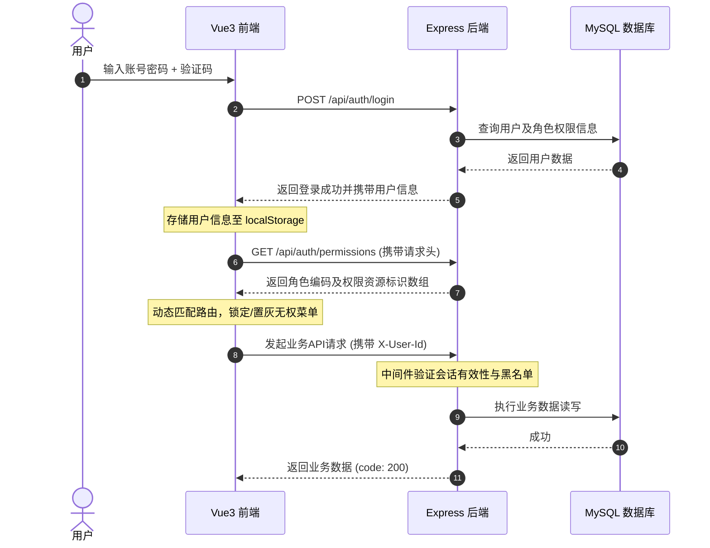
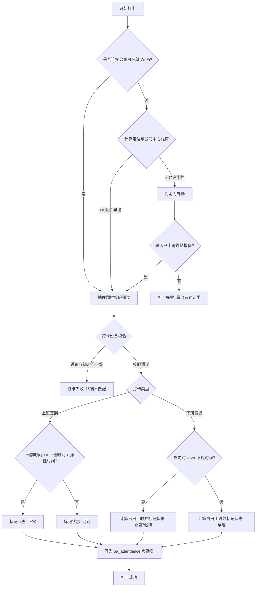
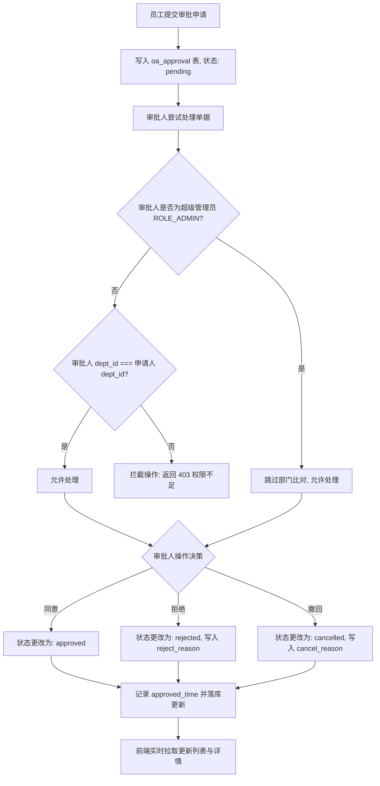

# 智能OA系统 核心业务流程说明书

本说明书详细阐述了智能OA办公系统中各个核心业务板块的业务逻辑、数据流向以及前后台交互流程。

---

## 1. 统一身份认证与权限鉴权流程

系统采用基于 `x-user-id` 请求头的轻量级无状态鉴权模型，并结合 RBAC（基于角色的访问控制）权限体系。

### 1.1 业务流程描述
1. **用户登录**：用户在前端输入账号密码及验证码。后端校验通过后，返回用户信息（不含密码哈希）。
2. **会话缓存**：前端将当前用户信息写入 `localStorage`（键为 `currentUser`）。
3. **请求拦截注入**：前端配置 Axios 全局请求拦截器，在发起任何 `/api` 请求时，自动读取 `localStorage` 并将 `X-User-Id`、`X-User-Name` 注入 HTTP Headers 中。
4. **后端网关鉴权**：后端中间件拦截所有请求，提取 `X-User-Id`，查验当前用户是否处于被踢出黑名单。若通过则放行；若缺失或处于黑名单，则返回 `401 Unauthorized` 强制前端跳转登录页。
5. **动态菜单控制**：前端在应用挂载时调用 `/api/auth/permissions`，获取用户所属角色的权限列表，并对无权访问的侧边栏菜单执行置灰及锁定操作。

### 1.2 流程图 (Mermaid)

---

## 2. 精准考勤打卡与工时结算流程

系统支持物理围栏与 Wi-Fi 白名单双重校验，自动折算日工时与月度账单。

### 2.1 业务流程描述
1. **获取定位**：员工进入考勤界面，前端触发 GPS 获取当前经纬度。
2. **位置匹配**：打卡时，后端读取 `sys_config` 中的公司中心点坐标（纬度/经度）和允许半径（默认300米）。
3. **多重验证逻辑**：
   * **Wi-Fi 优先**：如果员工连接了公司白名单 Wi-Fi，则自动判定处于打卡范围内。
   * **距离校验**：若无 Wi-Fi，则使用半正矢公式（Haversine）计算员工定位与公司中心点距离。若小于半径则判定在范围内；若大于则转为外勤打卡，并严格限制未报备外勤打卡的提交。
   * **设备防作弊**：验证打卡终端唯一标识，限制一个账号绑定单台设备打卡。
4. **状态判断**：根据打卡时间与弹性起止时间（如 09:00 + 15分钟弹性）判定为正常、迟到、早退或迟到早退。
5. **工时与月核算**：下班打卡时，系统计算与上班打卡的时间差，折算成日工时。月末由 HR 触发一键核算，汇总所有考勤日志生成结算报表。

### 2.2 流程图 (Mermaid)

---

## 3. 层级隔离审批流程

为保证数据隔离，非超级管理员的审批人仅能审批与自己同部门员工的申请单。

### 3.1 业务流程描述
1. **发起审批**：员工（如李明）选择审批类型（请假），输入标题和事由提交。系统在 `oa_approval` 插入一条状态为 `pending` 的单据。
2. **主管核查**：部门经理（如张强）登录，系统拉取处于待处理的审批单。
3. **部门权限校验（核心防线）**：
   * 张强点击审批李明的申请单。
   * 后端拦截器提取张强（审批人）的 `dept_id` 以及李明（申请人）的 `dept_id`。
   * **同部判定**：若 `approver.dept_id === applicant.dept_id` 或 审批人为超级管理员，则放行操作；否则抛出 `403` 权限不足错误，禁止越权审批。
4. **决策判定**：主管可选择“同意”或“拒绝”（需填写意见）。单据状态随之迁移为 `approved` 或 `rejected`，并记录处理时间。
5. **通知联动**：审批通过后，前端审批状态实时转为已通过，李明可查收详情；同时系统生成对应的考勤冲抵单（如销假/补卡）。

### 3.2 流程图 (Mermaid)

---

## 4. 其它核心业务流程

### 4.1 会议室预约与外部协同流程
1. **发起预约**：用户填写会议主题、会议室、使用起止时间、参会人员。
2. **冲突校验**：后端锁定 `room_id` 和时间段，比对是否存在重合会议，若有冲突则拦截并提示重新选择。
3. **外部同步**：预订成功后，若用户开启了第三方联动，后端会异步调用腾讯会议/钉钉接口创建网络会议，将联席 URL 和会议 ID 写回 `oa_meeting` 表，并自动通过消息模块向所有参会人推送日程通知。

### 4.2 资产领用归还与核销流程
1. **领用流程**：用户在资产列表中点击领用闲置状态（`status: 'idle'`）的固定资产，填写预期归还日期。系统变更资产状态为在用（`in_use`），并在 `oa_asset_record` 生成一条领用记录。
2. **归还流程**：用户发起归还。资产管理员查验设备完好后点击确认归还，系统将资产状态重新拨回 `idle`，标记领用记录归还时间，流程结转。
3. **折旧与报废**：系统根据 `purchase_date` 和 `depreciation_rate` 自动按月折算资产当前价值。当资产报废时，管理员手工标注 `scrapped`，锁定资产状态，不再允许领用。

### 4.3 任务分配与协作跟踪流程
1. **任务分派**：项目经理或团队成员发起任务，选定执行人、关联项目、优先级及截止日期。
2. **任务进展**：执行人可在任务卡片上随时更新任务进度百分比（0%-100%）。当进度达到 100% 时，任务状态自动转为“已完成”，并记录实际完成时间。
3. **超时预警**：系统通过定时任务每天比对当前日期与 `due_date`，对未完成且已过期的任务自动标记为“已逾期”，并向执行人发出待办催办消息。
