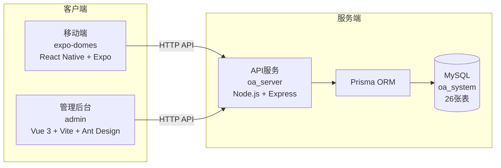

# 智能OA系统项目架构与页面关系图

本文档梳理了智能OA系统三个子项目的目录结构和路由导航流程。

---

## 项目概览

| 项目 | 技术栈 | 端口 | 说明 |
|------|--------|------|------|
| oa_server | Node.js + Express + Prisma | 3000 | 后端API服务 |
| admin | Vue 3 + Vite + Ant Design | 5174 | 管理后台前端 |
| expo-domes | React Native + Expo Router | 8081 | 移动端App |

---

## 1. 后端项目结构 (oa_server)

```text
oa_server/
├── src/
│   ├── index.ts                  # 入口文件（Express应用配置、路由挂载、服务启动）
│   ├── routes/                   # 路由模块目录（24个文件）
│   │   ├── auth.ts               # 认证接口（登录/登出）
│   │   ├── users.ts              # 用户管理（CRUD/详情/重置密码）
│   │   ├── departments.ts        # 部门管理（CRUD/树形结构）
│   │   ├── roles.ts              # 角色管理（CRUD/权限分配）
│   │   ├── permissions.ts        # 权限管理（CRUD/树形结构）
│   │   ├── tasks.ts              # 任务管理（CRUD/完成/分配）
│   │   ├── approvals.ts          # 审批管理（CRUD/通过/拒绝/撤销/待办）
│   │   ├── meetings.ts           # 会议管理（CRUD/取消）
│   │   ├── documents.ts          # 文档管理（CRUD/重命名/移动）
│   │   ├── assets.ts             # 资产管理（CRUD/领用/归还/我的记录）
│   │   ├── attendance.ts         # 考勤管理（打卡/记录/统计）
│   │   ├── salary.ts             # 薪资管理（CRUD/我的薪资）
│   │   ├── projects.ts           # 项目管理（CRUD）
│   │   ├── handovers.ts          # 交接管理（CRUD）
│   │   ├── notices.ts            # 公告管理（CRUD/已读/未读数）
│   │   ├── schedules.ts          # 日程管理（CRUD）
│   │   ├── processTemplates.ts   # 流程模板（CRUD）
│   │   ├── contracts.ts          # 合同管理（CRUD/我的合同）
│   │   ├── contacts.ts           # 通讯录（查询）
│   │   ├── messages.ts           # 消息管理（列表）
│   │   ├── positions.ts          # 岗位管理（列表）
│   │   ├── hr.ts                 # 人事信息（员工列表）
│   │   ├── system.ts             # 系统配置（获取/更新）
│   │   └── utils.ts              # 工具函数（通用查询条件构建器）
│   └── utils/                    # 辅助工具
├── prisma/
│   └── schema.prisma             # 数据库模型定义（26张表+1个视图）
├── .env                          # 环境变量（数据库连接等）
├── package.json                  # 项目配置
└── tsconfig.json                 # TypeScript配置
```

### 数据库表结构

| 模块 | 表名 | 说明 |
|------|------|------|
| 系统管理 | sys_user | 用户表 |
| | sys_department | 部门表 |
| | sys_position | 岗位表 |
| | sys_role | 角色表 |
| | sys_user_role | 用户角色关联表 |
| | sys_permission | 权限表 |
| | sys_role_permission | 角色权限关联表 |
| | sys_config | 系统配置表 |
| | sys_operation_log | 操作日志表 |
| | sys_message | 消息表 |
| 办公管理 | oa_attendance | 考勤表 |
| | oa_process_template | 流程模板表 |
| | oa_approval | 审批表 |
| | oa_approval_flow | 审批流程表 |
| | oa_project | 项目表 |
| | oa_task | 任务表 |
| | oa_meeting | 会议表 |
| | oa_schedule | 日程表 |
| 人力资源 | hr_employee_contract | 合同表 |
| | oa_salary | 薪资表 |
| 资产管理 | oa_asset | 资产表 |
| | oa_asset_record | 资产领用记录表 |
| 协作沟通 | oa_announcement | 公告表 |
| | oa_announcement_read | 公告已读表 |
| | oa_handover | 交接表 |
| | oa_document | 文档表 |

---

## 2. 管理后台前端项目结构 (admin)

```text
admin/
├── src/
│   ├── App.vue                   # 根组件
│   ├── main.ts                   # 入口文件
│   ├── api/                      # API接口定义
│   ├── assets/                   # 静态资源
│   ├── components/               # 公共组件
│   ├── store/                    # 状态管理（Pinia）
│   └── style.css                 # 全局样式
├── package.json
└── vite.config.ts
```

---

## 3. 移动端项目结构 (expo-domes)

```text
expo-domes/
├── src/
│   └── app/
│       ├── _layout.tsx           # 根布局 (Stack 导航容器)
│       ├── index.tsx             # [登录页] 账密登录 / 第三方登录入口
│       ├── workbench.tsx         # [工作台] 核心门户，集成快捷区、待办、公告和底部 Tab
│       ├── messages.tsx          # [消息中心] 消息列表、分类、未读角标
│       ├── contacts.tsx          # [通讯录] 员工名录、架构查看、一键拨号
│       ├── profile.tsx           # [个人中心] 个人信息、统计数据、退出登录
│       │
│       # 业务功能模块 (通过工作台/列表进行跳转)
│       ├── approval.tsx          # 审批中心 (待我审批/我发起的/我审批的)
│       ├── attendance.tsx        # 考勤打卡 (GPS定位打卡/考勤统计)
│       ├── tasks.tsx             # 任务管理 (任务列表/勾选完成/优先级)
│       ├── meetings.tsx          # 会议管理 (今日会议/进入在线会议)
│       ├── schedule.tsx          # 日程总结 (Timeline 时间轴日程)
│       ├── documents.tsx         # 文档中心 (云文档检索/分类过滤)
│       ├── salary.tsx            # 薪资管理 (电子工资条/明细显隐)
│       ├── assets.tsx            # 资产管理 (我的资产/在用与闲置状态)
│       ├── projects.tsx          # 项目管理 (项目进度条/团队成员/倒计时)
│       ├── workflows.tsx         # 流程管理 (审批流状态/当前节点跟踪)
│       ├── handover.tsx          # 工作交接 (交接任务进度条)
│       ├── notices.tsx           # 公告通知 (公司发文/规章制度列表)
│       ├── hr-management.tsx     # 人事管理 (员工名册/在职与试用状态)
│       └── performance.tsx       # 绩效管理 (绩效S/A/B等级、维度图表)
```

---

## 4. 移动端页面路由导航关系图 (Navigation Flow)

```mermaid
graph TD
    %% 样式定义
    classDef main fill:#5a5ce5,stroke:#333,stroke-width:2px,color:#fff;
    classDef sub fill:#f0f5ff,stroke:#5a5ce5,stroke-width:1px,color:#333;
    classDef tab fill:#ecfdf5,stroke:#10b981,stroke-width:1.5px,color:#111;

    %% 页面节点
    L["登录页 (index.tsx)"]:::main
    W["工作台 (workbench.tsx)"]:::main

    %% Tab 页面
    Msg["消息中心 (messages.tsx)"]:::tab
    Cont["通讯录 (contacts.tsx)"]:::tab
    Prof["个人中心 (profile.tsx)"]:::tab

    %% 功能模块节点
    Appr["审批中心 (approval.tsx)"]:::sub
    Att["考勤打卡 (attendance.tsx)"]:::sub
    Tsk["任务管理 (tasks.tsx)"]:::sub
    Meet["会议管理 (meetings.tsx)"]:::sub
    Sched["日程总结 (schedule.tsx)"]:::sub
    Doc["文档中心 (documents.tsx)"]:::sub
    Sal["薪资管理 (salary.tsx)"]:::sub
    Ast["资产管理 (assets.tsx)"]:::sub
    Proj["项目管理 (projects.tsx)"]:::sub
    Workf["流程管理 (workflows.tsx)"]:::sub
    Hand["工作交接 (handover.tsx)"]:::sub
    Noti["公告通知 (notices.tsx)"]:::sub
    HR["人事管理 (hr-management.tsx)"]:::sub
    Perf["绩效管理 (performance.tsx)"]:::sub

    %% 关系连线
    L -->|"登录成功"| W

    %% Tab 切换关系
    W <-->|"底部 Tab / 消息图标"| Msg
    W <-->|"底部 Tab"| Cont
    W <-->|"底部 Tab / 头像"| Prof

    %% 工作台快捷区跳转
    W -->|"快捷入口 / 待办处理"| Appr
    W -->|"快捷入口"| Att
    W -->|"快捷入口"| Cont
    W -->|"快捷入口"| Tsk
    W -->|"快捷入口"| Meet
    W -->|"快捷入口"| Sched
    W -->|"快捷入口"| Doc
    W -->|"快捷入口"| Sal

    %% 其他隐藏/深层链接跳转
    W -->|"快捷入口 / 全部"| Noti

    %% 其他系统流转
    Prof -->|"退出登录"| L
```



---

## 5. 系统整体架构


