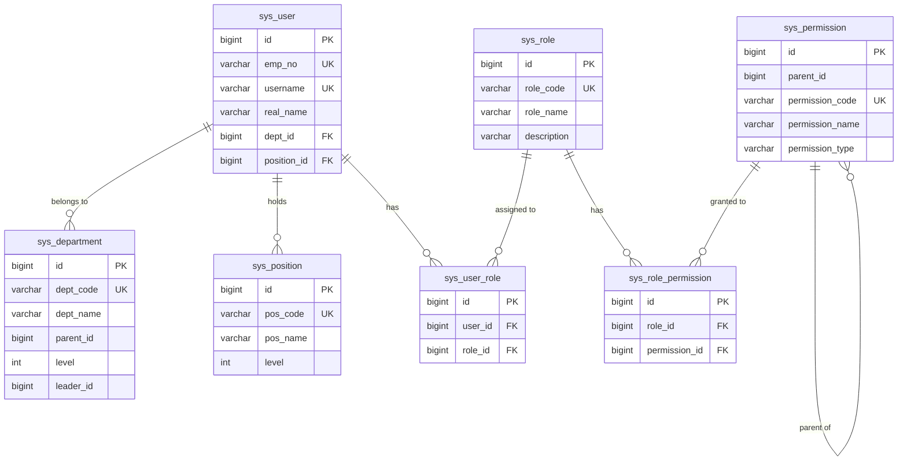
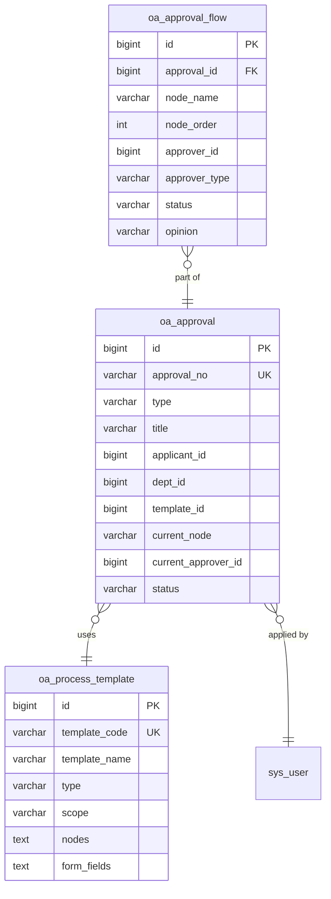
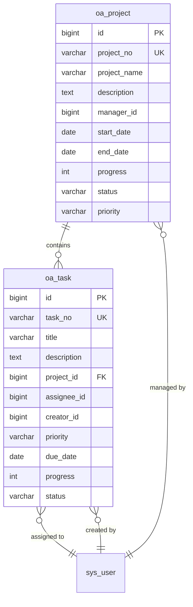
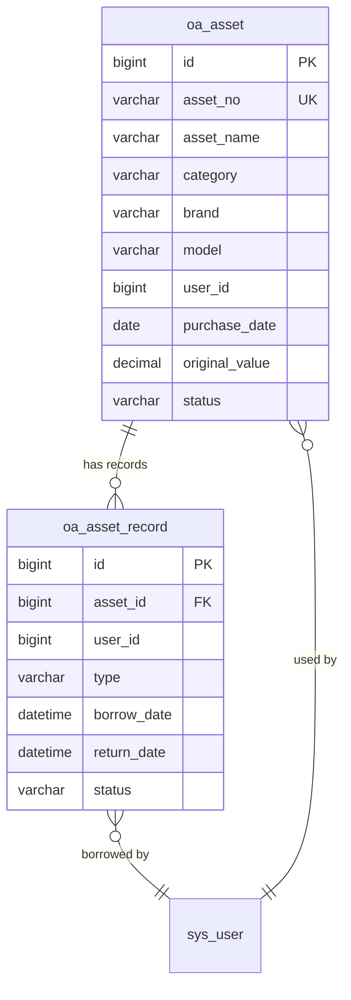
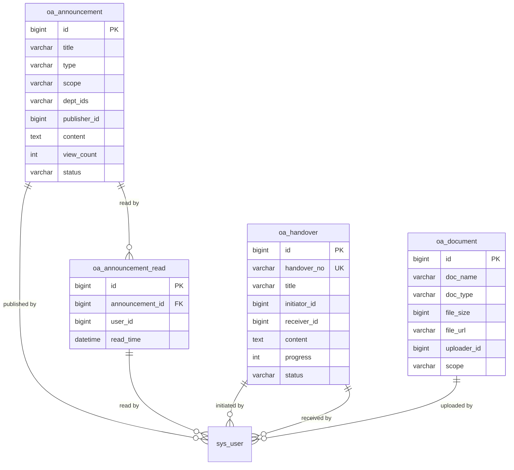

# 智能OA办公系统 - 数据库ER图

## 概览

> **数据库名称**: oa_system  
> **数据库类型**: MySQL 5.7+
> **表数量**: 26张  
> **生成时间**: 2026-05-19

---

## 完整ER图 (Mermaid格式)

```mermaid
erDiagram
    %% =============================================
    %% 系统管理模块 (10张表)
    %% =============================================
    
    sys_department {
        bigint id PK "主键ID"
        varchar dept_code UK "部门编码"
        varchar dept_name "部门名称"
        bigint parent_id "上级部门ID"
        int level "层级:1顶级 2二级"
        bigint leader_id "负责人ID"
        int sort "排序号"
        tinyint status "状态:0禁用 1正常"
        varchar remark "备注"
        datetime create_time "创建时间"
        datetime update_time "更新时间"
        tinyint is_deleted "删除标记:0否 1是"
    }
    
    sys_position {
        bigint id PK "主键ID"
        varchar pos_code UK "职位编码"
        varchar pos_name "职位名称"
        int level "职级:1-10"
        int sort "排序号"
        tinyint status "状态:0禁用 1正常"
        varchar remark "备注"
        datetime create_time "创建时间"
        datetime update_time "更新时间"
        tinyint is_deleted "删除标记:0否 1是"
    }
    
    sys_role {
        bigint id PK "主键ID"
        varchar role_code UK "角色编码"
        varchar role_name "角色名称"
        varchar description "角色描述"
        tinyint status "状态:0禁用 1正常"
        int sort "排序号"
        datetime create_time "创建时间"
        datetime update_time "更新时间"
        tinyint is_deleted "删除标记:0否 1是"
    }
    
    sys_permission {
        bigint id PK "主键ID"
        bigint parent_id "父权限ID"
        varchar permission_code UK "权限编码"
        varchar permission_name "权限名称"
        varchar permission_type "权限类型:menu/button/api"
        varchar route_path "路由路径"
        varchar component_path "组件路径"
        varchar icon "图标"
        int sort "排序号"
        tinyint status "状态:0禁用 1正常"
        datetime create_time "创建时间"
        datetime update_time "更新时间"
        tinyint is_deleted "删除标记:0否 1是"
    }
    
    sys_user {
        bigint id PK "主键ID"
        varchar emp_no UK "工号"
        varchar username UK "登录账号"
        varchar password "加密密码"
        varchar real_name "真实姓名"
        varchar nickname "昵称"
        tinyint gender "性别:0女 1男"
        varchar mobile "手机号"
        varchar email "邮箱"
        varchar avatar "头像URL"
        bigint dept_id FK "部门ID"
        bigint position_id FK "职位ID"
        tinyint status "状态:0禁用 1正常"
        date entry_date "入职日期"
        date contract_expire "合同到期日期"
        date probation_end "试用期结束日期"
        datetime last_login_time "最后登录时间"
        varchar last_login_ip "最后登录IP"
        int login_fail_count "登录失败次数"
        datetime lock_time "锁定时间"
        datetime create_time "创建时间"
        datetime update_time "更新时间"
        tinyint is_deleted "删除标记:0否 1是"
    }
    
    sys_user_role {
        bigint id PK "主键ID"
        bigint user_id FK "用户ID"
        bigint role_id FK "角色ID"
        datetime create_time "创建时间"
    }
    
    sys_role_permission {
        bigint id PK "主键ID"
        bigint role_id FK "角色ID"
        bigint permission_id FK "权限ID"
        datetime create_time "创建时间"
    }
    
    sys_config {
        bigint id PK "主键ID"
        varchar config_key UK "配置键"
        text config_value "配置值"
        varchar config_type "配置类型:string/number/boolean/json"
        varchar description "描述"
        varchar group_name "分组名称"
        datetime create_time "创建时间"
        datetime update_time "更新时间"
    }
    
    sys_operation_log {
        bigint id PK "主键ID"
        bigint user_id "用户ID"
        varchar username "用户名"
        varchar real_name "真实姓名"
        varchar module "模块名称"
        varchar operation "操作类型"
        varchar method "请求方法"
        varchar request_url "请求URL"
        text request_params "请求参数"
        varchar request_ip "请求IP"
        varchar ip_location "IP归属地"
        tinyint status "状态:0失败 1成功"
        varchar error_msg "错误信息"
        int execute_time "执行时长(毫秒)"
        datetime create_time "创建时间"
    }
    
    sys_message {
        bigint id PK "主键ID"
        bigint sender_id "发送人ID"
        bigint receiver_id "接收人ID"
        varchar type "类型:approval/notice/system"
        varchar title "消息标题"
        varchar content "消息内容"
        bigint related_id "关联ID"
        varchar related_type "关联类型"
        tinyint is_read "是否已读:0否 1是"
        datetime read_time "阅读时间"
        datetime create_time "创建时间"
    }
    
    %% =============================================
    %% 办公管理模块 (8张表)
    %% =============================================
    
    oa_attendance {
        bigint id PK "主键ID"
        bigint user_id "用户ID"
        date attend_date "考勤日期"
        time clock_in_time "上班打卡时间"
        time clock_out_time "下班打卡时间"
        decimal work_hours "工作时长(小时)"
        varchar clock_in_location "上班打卡位置"
        varchar clock_out_location "下班打卡位置"
        decimal clock_in_latitude "上班打卡纬度"
        decimal clock_in_longitude "上班打卡经度"
        decimal clock_out_latitude "下班打卡纬度"
        decimal clock_out_longitude "下班打卡经度"
        varchar clock_in_device "上班打卡设备"
        varchar clock_out_device "下班打卡设备"
        varchar status "状态:normal/late/early/late_early/absent/leave"
        varchar remark "备注"
        datetime create_time "创建时间"
        datetime update_time "更新时间"
    }
    
    oa_process_template {
        bigint id PK "主键ID"
        varchar template_code UK "流程编码"
        varchar template_name "流程名称"
        varchar type "类型:leave/expense/travel/overtime/purchase/seal"
        varchar scope "适用范围:all/dept"
        varchar dept_ids "部门ID列表(逗号分隔)"
        text nodes "节点配置JSON"
        text form_fields "表单字段JSON"
        tinyint status "状态:0停用 1启用"
        int sort "排序号"
        datetime create_time "创建时间"
        datetime update_time "更新时间"
        tinyint is_deleted "删除标记:0否 1是"
    }
    
    oa_approval {
        bigint id PK "主键ID"
        varchar approval_no UK "审批编号"
        varchar type "类型:leave/expense/travel/overtime/purchase/seal"
        varchar title "审批标题"
        bigint applicant_id "申请人ID"
        bigint dept_id "申请部门ID"
        text content "审批内容JSON"
        bigint template_id "流程模板ID"
        varchar current_node "当前审批节点"
        bigint current_approver_id "当前审批人ID"
        varchar status "状态:pending/approved/rejected/cancelled"
        varchar reject_reason "拒绝原因"
        varchar cancel_reason "撤回原因"
        datetime approved_time "通过时间"
        datetime create_time "创建时间"
        datetime update_time "更新时间"
    }
    
    oa_approval_flow {
        bigint id PK "主键ID"
        bigint approval_id FK "审批记录ID"
        varchar node_name "节点名称"
        int node_order "节点顺序"
        bigint approver_id "审批人ID"
        varchar approver_name "审批人姓名"
        varchar approver_type "审批人类型:user/role"
        bigint role_id "角色ID"
        varchar status "状态:pending/approved/rejected/skipped"
        varchar opinion "审批意见"
        datetime handle_time "处理时间"
        datetime create_time "创建时间"
    }
    
    oa_project {
        bigint id PK "主键ID"
        varchar project_no UK "项目编号"
        varchar project_name "项目名称"
        text description "项目描述"
        bigint manager_id "项目经理ID"
        date start_date "开始日期"
        date end_date "结束日期"
        int progress "进度:0-100"
        varchar status "状态:pending/in_progress/completed/paused"
        varchar priority "优先级:high/medium/low"
        datetime create_time "创建时间"
        datetime update_time "更新时间"
        tinyint is_deleted "删除标记:0否 1是"
    }
    
    oa_task {
        bigint id PK "主键ID"
        varchar task_no UK "任务编号"
        varchar title "任务标题"
        text description "任务描述"
        bigint project_id FK "所属项目ID"
        bigint assignee_id "负责人ID"
        bigint creator_id "创建人ID"
        varchar priority "优先级:high/medium/low"
        date due_date "截止日期"
        int progress "进度:0-100"
        varchar status "状态:pending/in_progress/completed/overdue"
        datetime completed_time "完成时间"
        datetime create_time "创建时间"
        datetime update_time "更新时间"
        tinyint is_deleted "删除标记:0否 1是"
    }
    
    oa_meeting {
        bigint id PK "主键ID"
        varchar meeting_no UK "会议编号"
        varchar title "会议主题"
        bigint organizer_id "组织者ID"
        bigint room_id "会议室ID"
        varchar room_name "会议室名称"
        datetime start_time "开始时间"
        datetime end_time "结束时间"
        text attendees "参会人ID列表JSON"
        varchar status "状态:upcoming/ongoing/completed/cancelled"
        text minutes "会议纪要"
        varchar cancel_reason "取消原因"
        datetime create_time "创建时间"
        datetime update_time "更新时间"
        tinyint is_deleted "删除标记:0否 1是"
    }
    
    oa_schedule {
        bigint id PK "主键ID"
        varchar title "日程标题"
        varchar description "日程描述"
        bigint user_id "用户ID"
        datetime start_time "开始时间"
        datetime end_time "结束时间"
        varchar location "地点"
        varchar type "类型:personal/team/meeting"
        text attendees "参会人ID列表JSON"
        int remind_minutes "提醒时间(分钟)"
        tinyint reminded "是否已提醒:0否 1是"
        datetime create_time "创建时间"
        datetime update_time "更新时间"
        tinyint is_deleted "删除标记:0否 1是"
    }
    
    %% =============================================
    %% 人事管理模块 (1张表)
    %% =============================================
    
    hr_employee_contract {
        bigint id PK "主键ID"
        bigint user_id "用户ID"
        varchar contract_no UK "合同编号"
        varchar contract_type "合同类型:labor/intern/outsource"
        date start_date "合同开始日期"
        date end_date "合同结束日期"
        int probation_months "试用期月数"
        date probation_end_date "试用期结束日期"
        decimal salary "基本工资"
        varchar status "状态:active/expired/terminated"
        date sign_date "签订日期"
        date terminate_date "终止日期"
        varchar terminate_reason "终止原因"
        varchar attachment_url "合同附件URL"
        varchar remark "备注"
        datetime create_time "创建时间"
        datetime update_time "更新时间"
    }
    
    %% =============================================
    %% 业务管理模块 (3张表)
    %% =============================================
    
    oa_salary {
        bigint id PK "主键ID"
        bigint user_id "用户ID"
        varchar month "月份(YYYY-MM)"
        decimal base_salary "基本工资"
        decimal position_allowance "岗位津贴"
        decimal performance_bonus "绩效奖金"
        decimal meal_allowance "餐补"
        decimal transport_allowance "交通补贴"
        decimal housing_allowance "住房补贴"
        decimal overtime_pay "加班费"
        decimal other_income "其他收入"
        decimal social_security "社保(个人)"
        decimal housing_fund "公积金(个人)"
        decimal income_tax "个人所得税"
        decimal other_deduction "其他扣除"
        decimal net_salary "实发工资"
        varchar status "状态:draft/paid"
        datetime paid_time "发放时间"
        datetime create_time "创建时间"
        datetime update_time "更新时间"
    }
    
    oa_asset {
        bigint id PK "主键ID"
        varchar asset_no UK "资产编号"
        varchar asset_name "资产名称"
        varchar category "分类:computer/phone/device/furniture/other"
        varchar brand "品牌"
        varchar model "型号"
        varchar specification "规格"
        bigint user_id "使用人ID"
        date purchase_date "购入日期"
        decimal original_value "原值"
        decimal current_value "当前价值"
        decimal depreciation_rate "折旧率"
        varchar status "状态:idle/using/repair/scrapped"
        varchar location "存放位置"
        varchar sn_code "序列号"
        date warranty_end_date "保修到期日期"
        varchar image_url "资产图片URL"
        varchar remark "备注"
        datetime create_time "创建时间"
        datetime update_time "更新时间"
        tinyint is_deleted "删除标记:0否 1是"
    }
    
    oa_asset_record {
        bigint id PK "主键ID"
        bigint asset_id FK "资产ID"
        bigint user_id "领用人ID"
        varchar type "类型:borrow/return/transfer/repair"
        datetime borrow_date "领用时间"
        datetime return_date "归还时间"
        date expected_return_date "预计归还日期"
        varchar status "状态:active/completed/cancelled"
        varchar remark "备注"
        datetime create_time "创建时间"
        datetime update_time "更新时间"
    }
    
    %% =============================================
    %% 沟通协作模块 (4张表)
    %% =============================================
    
    oa_announcement {
        bigint id PK "主键ID"
        varchar title "公告标题"
        varchar type "类型:announce/notice/policy"
        varchar scope "范围:all/dept"
        varchar dept_ids "部门ID列表(逗号分隔)"
        bigint publisher_id "发布人ID"
        text content "公告内容(HTML)"
        varchar attachments "附件URL列表(逗号分隔)"
        int view_count "阅读量"
        varchar status "状态:draft/published/withdrawn"
        datetime publish_time "发布时间"
        datetime withdraw_time "撤回时间"
        tinyint top "是否置顶:0否 1是"
        datetime create_time "创建时间"
        datetime update_time "更新时间"
        tinyint is_deleted "删除标记:0否 1是"
    }
    
    oa_announcement_read {
        bigint id PK "主键ID"
        bigint announcement_id FK "公告ID"
        bigint user_id "用户ID"
        datetime read_time "阅读时间"
    }
    
    oa_handover {
        bigint id PK "主键ID"
        varchar handover_no UK "交接编号"
        varchar title "交接标题"
        bigint initiator_id "交接人ID"
        bigint receiver_id "接收人ID"
        text content "交接内容"
        varchar attachments "附件URL列表(逗号分隔)"
        int progress "完成度:0-100"
        varchar status "状态:pending/confirmed/completed/cancelled"
        datetime confirm_time "确认接收时间"
        datetime complete_time "完成时间"
        varchar cancel_reason "取消原因"
        datetime create_time "创建时间"
        datetime update_time "更新时间"
        tinyint is_deleted "删除标记:0否 1是"
    }
    
    oa_document {
        bigint id PK "主键ID"
        varchar doc_name "文档名称"
        varchar doc_type "文档类型:word/excel/pdf/ppt/image/other"
        bigint file_size "文件大小(字节)"
        varchar file_url "文件URL"
        bigint folder_id "文件夹ID"
        bigint uploader_id "上传人ID"
        varchar scope "范围:personal/dept/public"
        varchar dept_ids "部门ID列表(逗号分隔)"
        int download_count "下载次数"
        int view_count "查看次数"
        varchar remark "备注"
        datetime create_time "创建时间"
        datetime update_time "更新时间"
        tinyint is_deleted "删除标记:0否 1是"
    }
    
    %% =============================================
    %% 关系定义
    %% =============================================
    
    sys_user ||--o{ sys_department : "belongs to"
    sys_user ||--o{ sys_position : "holds"
    sys_user ||--o{ sys_user_role : "has"
    sys_role ||--o{ sys_user_role : "assigned to"
    sys_role ||--o{ sys_role_permission : "has"
    sys_permission ||--o{ sys_role_permission : "granted to"
    sys_permission ||--o{ sys_permission : "parent of"
    
    oa_attendance }o--|| sys_user : "belongs to"
    oa_approval }o--|| sys_user : "applied by"
    oa_approval_flow }o--|| oa_approval : "part of"
    oa_project }o--|| sys_user : "managed by"
    oa_task }o--|| sys_project : "belongs to"
    oa_task }o--|| sys_user : "assigned to"
    oa_task }o--|| sys_user : "created by"
    oa_meeting }o--|| sys_user : "organized by"
    oa_schedule }o--|| sys_user : "belongs to"
    
    hr_employee_contract }o--|| sys_user : "signed by"
    
    oa_salary }o--|| sys_user : "belongs to"
    oa_asset }o--|| sys_user : "used by"
    oa_asset_record }o--|| oa_asset : "record of"
    oa_asset_record }o--|| sys_user : "borrowed by"
    
    oa_announcement }o--|| sys_user : "published by"
    oa_announcement_read }o--|| oa_announcement : "read by"
    oa_announcement_read }o--|| sys_user : "read by"
    oa_handover }o--|| sys_user : "initiated by"
    oa_handover }o--|| sys_user : "received by"
    oa_document }o--|| sys_user : "uploaded by"
```

---

## 模块分图

### 1. 系统管理模块

### 2. 办公管理模块 - 审批流程

### 3. 办公管理模块 - 项目任务

### 4. 资产管理模块

### 5. 沟通协作模块

---

## 表关系说明

### 系统管理模块关系

| 表名 | 关联表 | 关联类型 | 说明 |
|-----|-------|---------|------|
| sys_user | sys_department | 多对一 | 用户属于某个部门 |
| sys_user | sys_position | 多对一 | 用户担任某个职位 |
| sys_user | sys_user_role | 一对多 | 用户拥有多个角色 |
| sys_role | sys_user_role | 一对多 | 角色分配给多个用户 |
| sys_role | sys_role_permission | 一对多 | 角色拥有多个权限 |
| sys_permission | sys_role_permission | 一对多 | 权限分配给多个角色 |
| sys_permission | sys_permission | 自关联 | 权限可以有子权限 |

### 办公管理模块关系

| 表名 | 关联表 | 关联类型 | 说明 |
|-----|-------|---------|------|
| oa_attendance | sys_user | 多对一 | 考勤记录属于某个用户 |
| oa_approval | sys_user | 多对一 | 审批由某个用户发起 |
| oa_approval | oa_process_template | 多对一 | 审批使用某个流程模板 |
| oa_approval_flow | oa_approval | 多对一 | 审批流程属于某个审批 |
| oa_project | sys_user | 多对一 | 项目由某个用户管理 |
| oa_task | oa_project | 多对一 | 任务属于某个项目 |
| oa_task | sys_user | 多对一 | 任务分配给某个用户（负责人） |
| oa_task | sys_user | 多对一 | 任务由某个用户创建 |
| oa_meeting | sys_user | 多对一 | 会议由某个用户组织 |
| oa_schedule | sys_user | 多对一 | 日程属于某个用户 |

### 人事管理模块关系

| 表名 | 关联表 | 关联类型 | 说明 |
|-----|-------|---------|------|
| hr_employee_contract | sys_user | 多对一 | 合同属于某个用户 |

### 业务管理模块关系

| 表名 | 关联表 | 关联类型 | 说明 |
|-----|-------|---------|------|
| oa_salary | sys_user | 多对一 | 薪资属于某个用户 |
| oa_asset | sys_user | 多对一 | 资产由某个用户使用 |
| oa_asset_record | oa_asset | 多对一 | 领用记录属于某个资产 |
| oa_asset_record | sys_user | 多对一 | 资产由某个用户领用 |

### 沟通协作模块关系

| 表名 | 关联表 | 关联类型 | 说明 |
|-----|-------|---------|------|
| oa_announcement | sys_user | 多对一 | 公告由某个用户发布 |
| oa_announcement_read | oa_announcement | 多对一 | 阅读记录属于某个公告 |
| oa_announcement_read | sys_user | 多对一 | 阅读记录由某个用户创建 |
| oa_handover | sys_user | 多对一 | 交接由某个用户发起 |
| oa_handover | sys_user | 多对一 | 交接由某个用户接收 |
| oa_document | sys_user | 多对一 | 文档由某个用户上传 |

---

## 索引汇总

### 主键索引 (PK)

所有表都包含自增主键 `id` 字段。

### 唯一索引 (UK)

| 表名 | 字段 |
|-----|------|
| sys_department | dept_code |
| sys_position | pos_code |
| sys_role | role_code |
| sys_permission | permission_code |
| sys_user | emp_no, username |
| oa_attendance | user_id, attend_date |
| oa_process_template | template_code |
| oa_approval | approval_no |
| oa_project | project_no |
| oa_task | task_no |
| oa_meeting | meeting_no |
| hr_employee_contract | contract_no |
| oa_asset | asset_no |
| oa_handover | handover_no |

### 外键索引 (FK)

| 表名 | 外键字段 | 关联表 |
|-----|---------|-------|
| sys_user | dept_id | sys_department(id) |
| sys_user | position_id | sys_position(id) |
| sys_user_role | user_id | sys_user(id) |
| sys_user_role | role_id | sys_role(id) |
| sys_role_permission | role_id | sys_role(id) |
| sys_role_permission | permission_id | sys_permission(id) |
| oa_approval_flow | approval_id | oa_approval(id) |
| oa_task | project_id | oa_project(id) |
| oa_asset_record | asset_id | oa_asset(id) |
| oa_announcement_read | announcement_id | oa_announcement(id) |

---

## 数据字典

### 用户状态 (user.status)

| 值 | 说明 |
|----|------|
| 0 | 禁用 |
| 1 | 正常 |

### 审批状态 (oa_approval.status)

| 值 | 说明 |
|----|------|
| pending | 待审批 |
| approved | 已通过 |
| rejected | 已拒绝 |
| cancelled | 已取消 |

### 考勤状态 (oa_attendance.status)

| 值 | 说明 |
|----|------|
| normal | 正常 |
| late | 迟到 |
| early | 早退 |
| late_early | 迟到+早退 |
| absent | 缺勤 |
| leave | 请假 |

### 角色代码

| 代码 | 名称 | 说明 |
|-----|------|------|
| ROLE_ADMIN | 系统管理员 | 拥有所有权限 |
| ROLE_HR | 人事专员 | 人事管理权限 |
| ROLE_MANAGER | 部门管理者 | 部门管理权限 |
| ROLE_USER | 普通员工 | 基础办公权限 |

### 权限类型

| 值 | 说明 |
|----|------|
| menu | 菜单 |
| button | 按钮 |
| api | 接口 |

---

**文档结束** | 生成时间: 2026-05-19