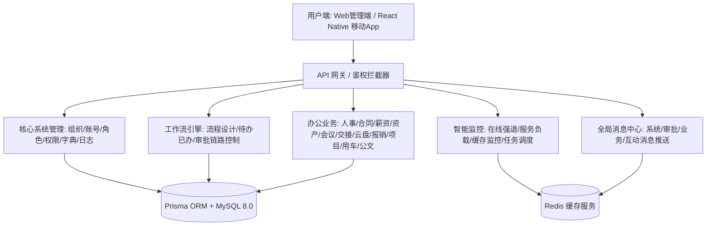
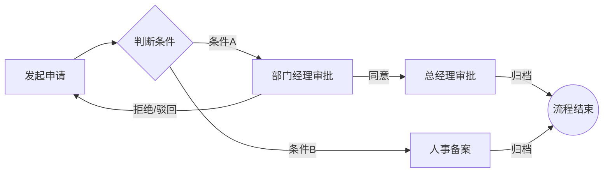

# OA协同办公系统需求规格说明书

**文档版本：** v5.0 (终极完整版)

**发布日期：** 2026-05-22

**密级：** 内部机密

**适用范围：** 本文档作为接口服务端 (oa_server)、管理后台前端 (admin) 以及移动端 App (expo-domes) 的核心需求及功能验收基准。

---

## 目录

1. [引言与系统定位](#1-引言与系统定位)
2. [总体功能架构设计](#2-总体功能架构设计)
3. [核心系统管理模块 (SYS)](#3-核心系统管理模块-sys)
4. [系统智能监控中心 (MONITOR)](#4-系统智能监控中心-monitor)
5. [系统开发辅助工具 (TOOLS)](#5-系统开发辅助工具-tools)
6. [工作流引擎与审批中心 (WORKFLOW)](#6-工作流引擎与审批中心-workflow)
7. [智能考勤打卡与考勤计算 (ATTENDANCE)](#7-智能考勤打卡与考勤计算-attendance)
8. [日常协同办公业务模块 (OA-BUSINESS)](#8-日常协同办公业务模块-oa-business)
9. [全局消息通知中心 (MESSAGE)](#9-全局消息通知中心-message)
10. [系统安全合规与非功能性需求](#10-系统安全合规与非功能性需求)
11. [统一接口交互协议规范](#11-统一接口交互协议规范)

---

## 1. 引言与系统定位

### 1.1 编写目的

本文档基于业界成熟的中后台解决方案（如 RuoYi 权限架构、Eladmin 运维架构、Ant Design Pro 交互设计）进行深度定制。旨在规范系统建设中的业务场景、流程控制、接口鉴权以及安全审计逻辑，确保多端（Web 管理端与 RN 移动端）业务逻辑的高度一致性与数据同步性。

### 1.2 核心理念

系统采用标准的 RBAC (Role-Based Access Control) 基于角色的权限控制模型，融合多级组织架构，支持按钮/操作级精细化资源鉴权。在数据访问层面，提供按部门及层级进行隔离的多维度数据权限过滤（Data Scope）。

---

## 2. 总体功能架构设计

系统由 **系统管理、系统监控、开发工具、工作流引擎、考勤套件、协同办公业务、全局消息中心** 七大板块构成，具体层次关系如下：



---

## 3. 核心系统管理模块 (SYS)

### 3.1 用户管理 (F-SYS-USER)

**需求概述：** 管理系统操作员的账号生命周期。

**详细规则：**

1. **基本 CRUD 与多维检索：** 支持基于工号、姓名、手机号、部门（支持层级下钻）、启用状态进行分页模糊查询。

2. **角色与岗位绑定：** 支持一个用户同时隶属于多个部门、拥有多个系统角色（如"部门主管"、"安全审计员"），并担任多个岗位（如"技术经理"、"项目总监"）。

3. **密码重置与安全锁定：** 管理员可一键将指定用户密码重置为系统默认密码（如 123456），并可在系统参数中配置"首次登录强制修改密码"。

4. **状态停用控制：** 一键启用或禁用账号。当账号被禁用时，系统立即拉黑该用户所有已发放的 JWT 令牌，拒绝后续一切请求。

5. **高敏感数据脱敏：** 用户手机号、身份证号、银行卡号等隐私数据，列表页自动脱敏展示（如 138****1234），仅授权管理员可查看完整数据，全程脱敏留存日志。

6. **登录安全管控：** 支持配置后台登录 IP 白名单，仅内网/指定 IP 段可访问管理后台；支持高权限账号开启 MFA 二次验证（短信/验证器），防范账号被盗风险。

   - **MFA 备选恢复方案：** 绑定备用邮箱用于恢复；生成 10 个一次性备用码（用户打印保存）；超级管理员可人工重置（需多重身份验证 + 审批流程）。

7. **批量导入功能：** 支持通过 Excel 模板批量导入用户，单次导入上限 2000 行。导入时进行数据校验（工号唯一性、手机号格式、部门有效性），导入失败时返回详细错误清单（行号 + 错误原因）。

### 3.2 角色管理 (F-SYS-ROLE)

**需求概述：** 权限的物理载体，通过角色定义用户能干什么以及能看什么。

**详细规则：**

1. **功能菜单授权：** 支持通过树形复选框，将目录权限、页面路由权限、以及页面按钮权限（如 sys:user:add）进行精细勾选与分配。

2. **数据权限级别 (Data Scope)：**
   - 全部数据权限：可读取全库数据，无视部门隔离
   - 自定义数据权限：仅可勾选并读取特定某些部门的数据
   - 本部门数据权限：仅可读取所属主部门的数据
   - 本部门及以下数据权限：可读取主部门以及旗下所有下属子部门的数据
   - 仅本人数据权限：仅可读取由当前用户创建的或流转单据中包含当前用户的数据

3. **导出权限管控：** 角色可单独配置「数据导出权限、导出数据范围」，所有导出操作自动记录审计日志，防止核心数据泄露。

4. **导入权限管控：** 角色可单独配置「数据导入权限」，与导出权限独立管控。

### 3.3 菜单与资源管理 (F-SYS-MENU)

**需求概述：** 动态构建系统的菜单树与接口的后端保护。

**详细规则：**

1. **类型划分：** M 目录（仅用于导航展开，无组件）、C 菜单（具体页面组件，对应前端组件路由路径）、F 按钮（具体的功能操作，如新增、删除、导出，带防重复点击绑定）。

2. **元数据属性：** 支持配置权限标识字符（如 sys:user:export）、菜单图标、显示状态（隐藏/显示）、路由缓存（Keep-Alive 开关）、外链地址（支持 iframe 嵌入或新窗口打开）。

### 3.4 部门架构管理 (F-SYS-DEPT)

**需求概述：** 维护企业树形组织结构。

**详细规则：**

1. **层级结构：** 支持无限层级的部门树配置，具备排序、负责人、状态控制。

2. **删除级联拦截：** 若该部门拥有子部门或该部门下仍有未移除的员工，则不允许直接删除，系统抛出警告。

### 3.5 岗位职务管理 (F-SYS-POST)

**需求概述：** 规范企业内部的职责序列。

**详细规则：**

1. 维护岗位编码（如 CEO, DEV, HR）、岗位名称与展示顺序。

2. 提供岗位关联接口，用于在工作流审批时作为"岗位责任人"自动寻址。

### 3.6 数据字典维护 (F-SYS-DICT)

**需求概述：** 消除代码硬编码，统一管理所有的状态枚举和下拉列表选项。

**详细规则：**

1. **字典类型维护：** 注册唯一的字典编码（如 sys_user_sex, oa_contract_status）。

2. **字典键值维护：** 定义字典标签（男、女）与对应的数据库存储值（1、2），支持配置排序、样式（如对应的 Tag 颜色：primary, danger）。

3. **动态拉取机制：** 前端在页面初始化时，统一请求字典接口获取配置，自动解析和渲染下拉框。

### 3.7 系统参数热配置 (F-SYS-CONFIG)

**需求概述：** 允许系统运维人员在不重新启动服务的情况下更改全局系统策略。

**详细规则：**

1. 支持配置系统名称、全局初始密码、连续登录失败锁定次数、密码过期天数、考勤打卡半径等。

2. 提供缓存同步机制，参数被修改时，系统动态刷新运行内存/Redis 中的参数配置。

### 3.8 安全审计日志 (F-SYS-LOG)

**需求概述：** 满足网络安全等级保护与合规审计要求。

**详细规则：**

1. **操作日志 (Operation Log)：** 拦截所有 POST、PUT、DELETE 请求。记录操作模块、操作类型、请求 URL、操作员 IP 地址及归属地、浏览器及操作系统环境、请求报文参数、返回报文结果、执行时长（毫秒）、操作状态。

2. **登录日志 (Login Log)：** 记录所有登录与注销行为。记录登录账号、IP 地址、浏览器类型、登录状态（成功/失败原因，如"密码错误"、"账号已被冻结"）、请求时间戳。

### 3.9 系统公告通知 (F-SYS-NOTICE)

**需求概述：** 企业内部通知发布的控制台。

**详细规则：**

1. 支持公告的分类管理（公告、通知、预警），支持富文本排版。

2. 具备发布状态（草稿、已发布、已下线）。已发布的公告将在 Web 端和移动 App 端的首页顶部动态滚动，并可支持对特定角色或特定部门的定向推送。

### 3.10 数据回收站管理 (F-SYS-RECYCLE)

**需求概述：** 防止核心数据误删丢失，满足运维溯源与数据恢复合规需求。

**详细规则：**

1. **软删除策略：** 核心业务数据（用户、合同、资产、审批单据等）执行删除操作时，不物理删除，自动进入回收站留存。

2. **硬删除例外场景：**
   - 用户主动勾选"彻底删除"的临时/草稿数据
   - 系统临时文件、操作日志（按保留周期自动清理）
   - 以上硬删除操作需二次确认，并全程留存审计日志

3. **回收站管理：** 支持按模块、操作时间、操作人检索已删除数据，支持单条/批量数据恢复。

4. **自动清理策略：** 支持配置数据自动清理周期（默认 30 天），超期数据自动物理销毁，同时全程留存删除审计日志。

### 3.11 多租户预留设计

**需求概述：** 为未来多租户架构预留扩展能力。

**详细规则：**

1. 所有业务表预留 `tenant_id` 字段（当前单租户模式下默认值为固定 ID）。

2. 租户之间组织、数据、流程完全隔离，互不干扰。

---

## 4. 系统智能监控中心 (MONITOR)

### 4.1 在线用户看板与强退 (F-MON-ONLINE)

实时解析分布式 Session 或 JWT 缓存，列表展示当前所有已通过身份验证的在线用户。提供"强制退出"按钮。执行强退后，系统立即将该用户凭证加入黑名单，使其在下一次接口调用时强制跳转回登录页。

### 4.2 服务器负载监控 (F-MON-SERVER)

采集服务器底层物理资源指标：CPU 使用率（按核心数百分比）、物理内存（总量、已用、可用、占用率）、磁盘空间（各个分区的已用和总空间）、Node.js/JVM 的堆栈占用、系统运行天数。

**预警机制：** 当 CPU 或内存连续 5 分钟超过 90% 时，向系统配置的管理员微信/邮件触发异常报警。

### 4.3 缓存监控 (F-MON-CACHE)

针对 Redis 或内存数据库的健康状态展示：系统连接数、内存占用、持久化状态、按 Key 键名规则分类的键数量。支持后台手动清除特定模式的缓存（如菜单缓存、系统参数缓存）。

### 4.4 定时调度任务控制 (F-MON-JOB)

提供基于 Cron 表达式的定时任务在线配置与管理。支持任务的增加、编辑、即时单次执行、暂停、恢复和删除。记录每一次定时任务的执行日志与耗时，防止并发冲突。

---

## 5. 系统开发辅助工具 (TOOLS)

### 5.1 代码生成器 (F-TL-GEN)

**适用范围：** 单表、简单主子表、不超过 3 个关联的表。

**详细规则：**

1. **反向工程：** 支持在后台读取指定数据库中所有已建表的表结构、字段名称、数据类型和注释。

2. **模板驱动：** 用户可配置生成方案（如单表、主子表），定义作者、项目包名、接口路径。

3. **一键生成：** 生成符合本项目规范的 Express 路由、Prisma 业务层、Vue3 页面、API 文件以及 SQL 脚本。

4. **代码标记：** 生成的代码自动打上 `// AUTO-GENERATED: DO NOT EDIT MANUALLY` 标记，复杂业务逻辑需在生成代码基础上手工扩展。

### 5.2 交互式接口文档 (F-TL-API)

后端路由基于 OpenAPI / Swagger 规范进行自动构建。提供后台管理专属的 `/swagger-ui` 或 `/doc.html` 路径，使前端和移动端开发人员可进行无障碍接口查阅与在线调试。

---

## 6. 工作流引擎与审批中心 (WORKFLOW)

系统内置符合 BPMN 2.0 规范的轻量级工作流审批引擎。



### 6.1 流程设计与模板配置 (F-WF-DESIGN)

1. **审批模板配置：** 支持定义审批流的业务属性（如请假、报销、采购）。

2. **节点配置：** 支持配置审批链（审批人、抄送人），审批人可配置为指定用户、指定角色、特定岗位、或动态计算（如"发起人的直属主管"）。

3. **分支条件：** 支持基于表单数据配置条件分支（例如：请假天数 ≤ 3 天由部门经理审批；请假天数 > 3 天需总监与 HR 双重审批）。

4. **预置通用模板库：** 系统默认预置请假、加班、出差、补卡、费用报销、资产领用、采购申请、合同审批、会议申请全套通用流程模板，支持直接启用、修改复用，无需从零搭建。

### 6.2 流程运行状态监控 (F-WF-MONITOR)

运维人员可监控所有正在运行中的流程实例。提供"强行中止"、"流程转办"或"流程作废"操作，应对异常挂起的审批业务。

### 6.3 个人审批工作台 (F-WF-WORKSPACE)

1. **待我审批 (Todo List)：** 列出当前等待当前用户审批的所有任务，支持批量同意。

2. **我已审批 (Done List)：** 列出当前用户曾经审批过的历史流程明细。

3. **我发起的 (My Request)：** 列出由当前用户发起的审批实例，实时查看流程流转图，并支持在下一个节点未处理前撤回申请。

4. **抄送我的 (Carbon Copy)：** 提供只读查看，支持批量标记已读。

### 6.4 核心流转规则

1. **多重驳回：** 审批人可选择"驳回至上一级"或"驳回至发起人"，发起人重新修改后可选择"原路返回"或"重新跑流程"。

2. **转办与加签：**
   - 转办 (Forward)：将审批权限移交给他人处理
   - 加签 (Add Sign)：审批人在当前节点临时引入他人进行协同审批，分为"前加签"和"后加签"

3. **会签 (Counter-Sign)：** 支持"或签"（一人同意即可通过）与"会签"（所有审批人全部同意方可通过，支持配置通过百分比）。

4. **审批超时规则：**
   - 每个审批节点可自定义超时时间（24h/48h/自定义时长）
   - 超时默认策略：自动转交上级（而非自动通过）
   - 若需配置"超时自动通过"，必须在流程设计时强制打标并二次确认，仅限普通知会类节点使用
   - 超时触发消息提醒

5. **代理审批规则：** 支持用户自主设置临时审批代理，可指定代理时间段、指定可代理的审批流程类型，用户请假、出差期间，系统自动将待办审批流转至代理人处理。

6. **审批精细化管控：** 支持配置审批撤回时效、驳回原因必填、审批留言、审批附件补充功能，所有审批操作全程留痕，满足企业合规要求。

### 6.5 事务一致性保障

1. **核心审批操作** 使用数据库事务，确保流程状态、审批记录、业务回调的一致性。

2. **消息发送** 采用"先落库后异步发送"的可靠消息模式，避免消息丢失。

3. **异常补偿机制：** 提供"审批异常补偿任务"，定时扫描状态不一致的流程实例，自动修复或告警。

---

## 7. 智能考勤打卡与考勤计算 (ATTENDANCE)

### 7.1 多端考勤打卡 (F-ATT-PUNCH)

1. **考勤规则配置：** 系统可针对不同岗位或部门配置考勤方案：固定班制（如 9:00 - 18:00）、弹性班制（如满 8 小时）、轮班/倒班制（支持多班次自定义排班）。

2. **地理围栏定位打卡：** 移动端打卡时，获取高德/谷歌地图 GPS 经纬度，与配置的公司围栏坐标及半径（如 300 米内）进行校验，超出距离判定为"外勤打卡"。

3. **网络与设备校验：** 绑定公司专用办公 Wi-Fi MAC 地址或外网出口 IP，在此网络环境内即可无视距离直接打卡；绑定手机唯一设备序列号，防代打卡。

### 7.2 考勤数据联动与审批 (F-ATT-LEAVE)

1. **异常申诉：** 员工漏打卡可在线发起"补卡申请"，审批通过后自动冲销异常。

2. **假期联动：** 请假、出差、加班审批流程归档后，考勤计算引擎自动重算员工的考勤状态。

3. **完整假期体系：** 系统预置年假、事假、病假、婚假、产假、丧假、调休等全类型假期，支持自定义各类假期额度、适用岗位、抵扣规则。

4. **年假自动结算：** 支持按员工入职工龄自动核算年度年假额度，配置年假清零周期、到期提醒、假期抵扣优先级，自动统计剩余年假。

5. **加班调休转化：** 支持加班时长自动折算调休额度，员工可在线发起调休申请，审批通过后自动核销调休时长，实现加班-调休数据闭环。

### 7.3 考勤汇总报表 (F-ATT-REPORT)

按月自动生成全员考勤明细报表（包含：迟到次数及分钟数、早退次数、旷工天数、请假小时数、加班小时数、打卡率）。支持导出为标准的 Excel，作为财务薪资核算扣款的核心数据输入。

### 7.4 智能排班管理 (F-ATT-SHIFT)

支持自定义多班次（早班、晚班、夜班、轮休），支持按天/按周批量排班、批量调班，适配客服、生产、运维等倒班岗位；排班数据自动同步至打卡规则，异常排班自动生成提醒。

### 7.5 考勤计算性能优化

1. **增量计算策略：** 每日凌晨只重算前一天有打卡记录或审批变动的员工，而非全员全量重算。

2. **月度核对机制：** 每月 1 号执行一次全量核对，确保数据准确性。

3. **分页与限流：** 重算任务支持分页处理、限流控制、断点续跑，避免数据库高峰压力。

---

## 8. 日常协同办公业务模块 (OA-BUSINESS)

### 8.1 人事档案管理 (F-OA-HR)

1. **员工全生命周期档案：** 记录入职时间、合同期限、转正时间、社保基数、银行卡号等完整档案。

2. **异动记录：** 自动记录员工历次调岗、晋升、降职、调薪的历史，形成人事异动链条。

3. **批量导入导出：** 支持员工花名册的批量导入（单次 ≤2000 行）与导出，导入失败时返回详细错误清单。

### 8.2 劳动合同管理 (F-OA-CONTRACT)

1. **合同管理：** 维护员工与公司签订的合同详情（合同编号、合同类型、生效日期、到期日期、合同附件 PDF）。

2. **到期预警功能：**
   - 预警周期：提前 30 天、15 天、7 天、3 天、到期当天分别提醒
   - 到期后合同状态自动变更为"已过期"，并禁止关联操作（如续签、调岗）

### 8.3 智能薪资与工资条 (F-OA-SALARY)

1. **薪资结构配置：** 支持定义员工的基本工资、绩效工资、各类津贴、社保公积金代扣规则、个人所得税计算公式。

2. **工资单下发与安全查看：**
   - 移动端：指纹/手势/查询密码验证
   - Web端：仅查询密码验证 + 自动超时退出（10分钟无操作强制关闭工资条页面）
   - 禁止截图（前端添加防截图水印）

### 8.4 资产与设备流转 (F-OA-ASSET)

1. **资产卡片管理：** 记录每一台电脑、打印机或办公家具的资产编码（支持生成唯一条形码/二维码）、规格型号、保管人、当前状态（空闲、领用、送修、报废）。

2. **领用与退库申请：** 员工在移动端在线申请领用资产，审批通过后，资产管理员确认出库并自动关联保管人；员工离职时，系统强制生成"退库单"。

3. **资产全生命周期管理：** 新增资产维保申请、维保记录归档、资产报废审批、资产折旧核算功能，完整覆盖资产入库、领用、维保、报废全流程。

### 8.5 云盘与企业知识库 (F-OA-DOC)

1. **多级目录树网盘：** 支持企业内部公共云盘和个人私有云盘。

2. **细粒度文件权限：**
   - 仅预览（禁止下载/打印/复制）
   - 预览 + 下载
   - 预览 + 编辑 + 下载
   - 禁止访问
   - 权限可配置给不同角色、部门或个人

3. **在线预览：** 支持 PDF、图片、Word、Excel 的在线即时预览，防止源文件泄露。

### 8.6 会议室智能预订 (F-OA-MEETING)

1. **时间轴占用看板：** 直观展示各个会议室在不同时间段的预订占用状态。

2. **冲突硬性拦截：** 若预订时间段发生重叠，系统硬性拦截预订；预订成功后自动向所有参会人推送系统日程提醒。

### 8.7 核心工作交接系统 (F-OA-HANDOVER)

**场景概述：** 用于员工调岗、离职或长期休假时的业务快速移交。

**数据一键转移：** 交接发起后，支持一键将离职人员担任的审批节点负责人、未完成的任务指派人、其所管辖的项目、名下保管的劳动合同以及名下的固定资产，批量变更转移给接收人，保证企业业务不中断。

### 8.8 费用报销管理 (F-OA-EXPENSE)

**需求概述：** 实现企业日常费用、差旅费用全流程线上审批与财务核销，补齐 OA 核心办公能力。

**详细规则：**

1. 支持日常报销、差旅报销、对公费用报销多类型单据，可自定义报销类目、报销额度、费用归属部门/项目。

2. 支持上传电子发票、票据图片，系统自动识别发票信息，防范重复报销。

3. 配套专属审批流程，支持多级审批、财务审核、领导终审，审批完成后财务可在线完成核销、打款登记。

4. 自动归档所有报销单据，支持按时间、部门、人员、费用类型统计报销数据，生成财务报表。

### 8.9 任务与项目管理 (F-OA-PROJECT)

**需求概述：** 满足团队日常任务派发、项目进度管控、工作落地追踪需求。

**详细规则：**

1. 支持创建项目、拆分子任务，设置任务责任人、参与人、截止时间、优先级。

2. 支持任务进度更新、进度留言、附件上传、逾期提醒，自动统计任务完成率。

3. 支持项目归档、历史项目查询、团队工作量统计，实现团队协同闭环。

### 8.10 企业用车管理 (F-OA-CAR)

**需求概述：** 规范企业公务车辆使用、维保、调度全流程管理。

**详细规则：**

1. 车辆档案管理：登记车辆牌照、车型、购置时间、维保记录、归属部门、当前状态。

2. 用车申请审批：员工发起用车申请，填写行程、时间、用车事由，审批通过后调度派车。

3. 行程记录、用车台账自动归档，支持车辆维保、年检、保险到期预警。

### 8.11 公文流转管理 (F-OA-OFFICIAL)

**需求概述：** 满足企业正规化、政企单位公文收发、审批、归档需求。

**详细规则：**

1. 支持发文、收文两大核心场景，内置红头文件模板、公文格式规范。

2. 公文支持多级审批、会签、抄送，流转全程留痕。

3. 所有公文自动归档，支持权限化查阅、检索、导出，保证公文合规管理。

---

## 9. 全局消息通知中心 (MESSAGE)

**需求概述：** 统一承接系统所有业务提醒，实现多端消息同步、聚合管理，解决业务无提醒、待办无感知问题，是系统核心基础能力。

### 9.1 消息分类体系

1. **系统消息：** 账号冻结、权限变更、密码过期、系统公告、系统配置变更
2. **审批消息：** 待审批、审批驳回、审批通过、流程转办/加签、审批超时提醒
3. **业务消息：** 会议预约结果、资产审批、合同到期、考勤异常、薪资下发、报销进度、用车审批提醒
4. **互动消息：** 工作抄送、交接完成、文件共享提醒、任务到期提醒

### 9.2 核心功能规则

1. **多端同步：** Web 端 + 移动端 App 消息实时同步，已读、未读状态双向互通，数据完全一致。

2. **全局角标提醒：** 系统全局展示未读消息红点、数字角标，支持一键全部已读、批量标记已读。

3. **多渠道推送：** 支持站内通知、App 推送（极光/个推）、邮件推送，支持后台配置各类消息推送开关。

4. **个性化消息设置：** 普通用户可自主关闭非核心消息推送；考勤、薪资、审批等重要通知为系统强制推送，不可关闭。

5. **消息检索与留存：** 消息永久留存，支持按类型、时间、关键词检索，支持消息详情跳转对应业务页面。

### 9.3 移动端离线适配

1. **离线缓存范围：** 仅缓存查询类数据（审批记录、考勤数据、消息历史），不缓存提交类数据。

2. **离线操作队列：** 离线提交的操作进入"待同步队列"，联网后自动重试并提示冲突解决。

3. **存储上限：** 离线缓存上限为 1000 条记录，超出时自动清理最早的数据并提示用户。

---

## 10. 系统安全合规与非功能性需求

### 10.1 安全防卫机制 (SEC)

1. **高强度哈希加盐密码：** 密码在存储时必须使用 Bcrypt 算法进行加盐哈希，绝对禁止以明文、MD5 或 Base64 等可逆/易破解的形式入库。

2. **账号防暴破锁定：** 5 分钟内同一账号连续输入错误密码达到 5 次，立即锁定该账号 30 分钟。

3. **参数化防注入：** 底层 Prisma 数据库访问层必须 100% 采用参数化查询，绝不允许在 SQL 语句中拼接不可信的前端入参。

4. **XSS & CSRF 防御：** 后端服务对所有 HTML 输入进行消毒（Sanitization），防范跨站脚本攻击；JWT 认证模式辅以 HttpOnly Cookie / 强 Header 认证防范跨站请求伪造。

### 10.2 性能与可靠性指标 (NFR)

1. **接口延迟：** 系统的核心查询接口（如用户列表、权限树）平均响应时间在局域网内不得超过 100ms，互联网延迟不得超过 300ms。

2. **高频防刷限流：** 对核心登录接口、密码重置接口进行 IP 限流控制（如同一 IP 每秒最多请求 3 次，超出则返回 429 Too Many Requests）。

3. **自动数据备份：** 生产数据库必须配置为每日凌晨自动执行热备份，并自动将备份包传输至异地存储，保留最近 30 天备份包。

### 10.3 拓展架构需求

系统预留多租户隔离架构能力，支持后续快速迭代适配多子公司、多分支机构、外包团队独立数据隔离场景，租户之间组织、数据、流程完全隔离，互不干扰。所有业务表已预留 `tenant_id` 字段。

---

## 11. 统一接口交互协议规范

为了保证前端 Web、移动 App 与后端服务能高效、无差错地反序列化数据，所有 API 接口在调用完毕后，必须以以下标准的 JSON 包裹体进行返回：

```json
{
  "code": 200,
  "data": {},
  "msg": "操作成功"
}
```

### 11.1 业务状态码定义

| 状态码 | 含义 |
|--------|------|
| 200 | 成功 |
| 400 | 入参有误 |
| 401 | 未登录/凭证过期 |
| 403 | 权限不足 |
| 409 | 数据冲突（重复提交、版本冲突） |
| 422 | 业务校验失败（如请假天数超过剩余假期） |
| 429 | 请求过快被限流 |
| 500 | 服务器内部异常 |
| 503 | 服务熔断/降级中 |

### 11.2 分页查询响应格式

当系统处理列表查询时，data 应统一包裹分页元数据：

```json
{
  "code": 200,
  "data": {
    "list": [],
    "total": 128,
    "pageNum": 1,
    "pageSize": 10,
    "orderBy": "createTime",
    "orderDir": "desc"
  },
  "msg": "查询成功"
}
```

### 11.3 分页请求参数规范

```json
{
  "pageNum": 1,
  "pageSize": 10,
  "orderBy": "createTime",
  "orderDir": "desc"
}
```

---

## 文档修订记录

| 版本 | 日期 | 修订内容 | 修订人 |
|------|------|----------|--------|
| v4.1 | 2026-05-22 | 初始版本 | - |
| v5.0 | 2026-05-22 | 完善数据回收站策略、MFA备选方案、批量导入规范、工作流超时合规约束、云盘权限细化、工资条安全规范、多端离线缓存边界、代码生成器适用范围、事务一致性保障、考勤计算性能优化、列表排序规范、错误码体系补充 | - |

---

**文档结束**